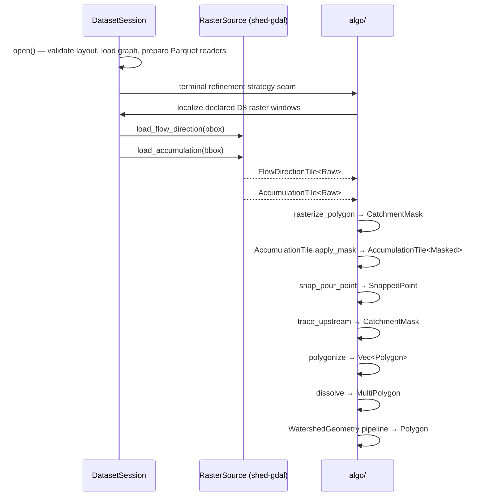

# shed-core

Pure-Rust core library for the shed watershed extraction engine. It handles two responsibilities: loading HFX datasets from disk (`session` + `reader`), and providing all watershed-delineation algorithms (`algo`). External capabilities — GDAL raster I/O, GEOS geometry repair — are kept behind traits defined here and implemented in `shed-gdal`, so the hot path has no native dependencies.

## Snap Strategy

`ResolverConfig::new()` defaults to `SnapStrategy::WeightFirst` to align with the HFX v0.2 weight contract, which requires that the `weight` column be monotonically increasing in drainage dominance (higher weight = more hydrologically significant reach). Under this default, when an outlet is coincident with a tiny tributary stub, the hydrologically dominant mainstem candidate wins over the geometrically closest one. `SnapStrategy::DistanceFirst` remains available for datasets whose `weight` column is not rank-meaningful: configure it via `ResolverConfig::new().with_snap_strategy(SnapStrategy::DistanceFirst)`.

## Staged Delineation Contract

M3 fixes the delineation skeleton around typed intermediate outputs. Step 1 documents the method signatures as a contract; later M3 steps add the method bodies without changing the existing `Engine::delineate` result surface.


```rust
pub fn select_level(&self, choice: LevelSelection) -> Result<SelectedLevel, EngineError>;

pub fn resolve_outlet_at_level(
    &self,
    outlet: GeoCoord,
    level: SelectedLevel,
    config: &ResolverConfig,
) -> Result<LevelResolvedOutlet, EngineError>;

pub fn traverse_upstream_at_level(
    &self,
    outlet: &LevelResolvedOutlet,
) -> Result<SameLevelUpstreamUnits, EngineError>;

pub fn produce_pre_merge_units(
    &self,
    upstream: &SameLevelUpstreamUnits,
) -> Result<PreMergeDrainageUnits, EngineError>;

pub fn refine_terminal_placeholder(
    &self,
    resolved: &LevelResolvedOutlet,
    units: &PreMergeDrainageUnits,
    options: &DelineationOptions,
) -> Result<TerminalRefinement, EngineError>;

pub fn dissolve_watershed(
    &self,
    units: &PreMergeDrainageUnits,
    refinement: &TerminalRefinement,
    options: &DelineationOptions,
) -> Result<DissolvedWatershed, EngineError>;

pub fn compose_result(
    &self,
    resolved: LevelResolvedOutlet,
    upstream: SameLevelUpstreamUnits,
    refinement: TerminalRefinement,
    dissolved: DissolvedWatershed,
) -> DelineationResult;
```

`PreMergeDrainageUnit` is an inspection record for pristine upstream drainage
units. The collection includes the whole terminal polygon before any terminal
refinement. This intentionally diverges from the final watershed result:
summing pre-merge `area` values does not define final `area_km2`, and unioning
pre-merge geometries does not define final refined geometry. Final geometry and
area are produced only by the downstream dissolve/assemble stage.

M4 exposes the Rust terminal-refinement strategy seam with a deliberately
D8-specific pantry: the strategy receives the `DatasetSession` plus the
engine-attached `RasterSource` needed by the built-in D8 path. Full custom
auxiliary binding and general aux-to-strategy dispatch remain deferred.

## Architecture

```mermaid
graph TD
    session[DatasetSession\nsession.rs] --> reader[reader/]
    reader --> manifest[manifest.rs\nparse manifest.json]
    reader --> graph[graph.rs\ndecode graph.arrow]
    reader --> catchment[catchment_store.rs\nlazy Parquet reader]
    reader --> snap[snap_store.rs\nlazy Parquet reader]

    algo[algo/] --> foundation[Foundation Types\ncoord · area · distance\ngeo_transform · flow_dir\nsnap_threshold · clean_epsilon\ntile_state]
    algo --> raster_infra[Raster Infrastructure\nraster_tile · flow_direction_tile\naccumulation_tile · catchment_mask]
    algo --> algorithms[Raster Algorithms\ntrace · snap · rasterize · polygonize]
    algo --> graph_traversal[Graph Traversal\ncollect_upstream]
    algo --> geometry[Geometry Processing\ndissolve · clean_topology · hole_fill\nlargest_polygon · watershed_area\nself_intersection]
    algo --> pipeline[Pipeline + Traits\nwatershed_geometry · traits]

    traits[traits.rs] -.->|implemented by| shed_gdal[shed-gdal]
```

**Data flow for a delineation:**



## Glossary

| Term | Meaning |
|---|---|
| Atom | Fundamental spatial unit in HFX — one catchment polygon with an ID, area, and WKB geometry |
| AtomId | Unique positive `i64` identifier for an atom (newtype in `hfx_core`) |
| D8 | Eight-direction flow model where each raster cell drains to exactly one of its 8 neighbours |
| ESRI D8 | D8 encoding using powers of two: E=1, SE=2, S=4, SW=8, W=16, NW=32, N=64, NE=128 |
| TauDEM D8 | D8 encoding counter-clockwise from east: E=1, NE=2, N=3, NW=4, W=5, SW=6, S=7, SE=8 |
| Upstream set | All atoms reachable via upstream adjacency from a terminal atom, inclusive of the terminal itself |
| Pour point | The outlet cell of a watershed — the single cell where flow exits the catchment |
| Snap | Moving a pour point to the nearest high-accumulation cell within a catchment mask |
| SnapThreshold | Minimum flow-accumulation pixel count a cell must exceed to be a snap candidate |
| Dissolve | Boolean union of all catchment polygons in the upstream set into one multi-polygon |
| CleanEpsilon | Tiny buffer distance (degrees) used in buffer-unbuffer topology cleaning |
| HoleFillMode | Policy for interior holes: remove all, or keep holes above an area threshold |
| Typestate | Compile-time state tracking via zero-size type parameters (`Raw`/`Masked`, `Dissolved`/`TopologyCleaned`/`HolesFilled`) |
| GeoTransform | GDAL-style affine transform storing origin + pixel dimensions (no rotation/shear) |
| Row-group pruning | Skipping Parquet row groups whose bbox statistics don't intersect the query bbox |

## Key Types

### Session / Reader layer

| Type | File | Role |
|---|---|---|
| `DatasetSession` | `session.rs` | Entry point — open an HFX dataset, validate layout, expose readers |
| `RasterPaths` | `session.rs` | Validated paths to `flow_dir.tif` + `flow_acc.tif` (no GDAL handles) |
| `TerminalRefinementStrategy` | `refinement.rs` | Object-safe terminal-refinement seam; M4's pantry is D8-only |
| `CatchmentStore` | `reader/catchment_store.rs` | Lazy Parquet reader for `catchments.parquet` with bbox pruning |
| `SnapStore` | `reader/snap_store.rs` | Lazy Parquet reader for `snap.parquet` with bbox pruning |
| `SessionError` | `error.rs` | All dataset-open and read errors |

### Algorithm layer

| Type / Function | File | Role |
|---|---|---|
| `WatershedGeometry<S>` | `algo/watershed_geometry.rs` | Typestate pipeline: `Dissolved` → `TopologyCleaned` → `HolesFilled` → `Polygon` |
| `FlowDirectionTile<S>` | `algo/flow_direction_tile.rs` | Typed D8 raster tile; `S` is `Raw` or `Masked` |
| `AccumulationTile<S>` | `algo/accumulation_tile.rs` | Typed flow-accumulation tile; `apply_mask` transitions `Raw` → `Masked` |
| `CatchmentMask` | `algo/catchment_mask.rs` | Boolean visited-cell set; output of `trace_upstream` and `rasterize_polygon` |
| `RasterTile<T>` | `algo/raster_tile.rs` | Generic row-major tile with OOB-safe `(isize,isize)` indexing |
| `GeoTransform` | `algo/geo_transform.rs` | Pixel ↔ geographic coordinate conversion |
| `FlowDir` | `algo/flow_dir.rs` | D8 direction enum with ESRI and TauDEM decoding |
| `SnappedPoint` | `algo/snap.rs` | Result of a successful pour-point snap (grid cell + geo coord + accumulation) |
| `snap_pour_point` | `algo/snap.rs` | Snap outlet to nearest masked cell above `SnapThreshold` |
| `trace_upstream` | `algo/trace.rs` | DFS upstream traversal returning a `CatchmentMask` |
| `collect_upstream` | `algo/upstream.rs` | BFS upstream traversal over `DrainageGraph` — returns `UpstreamAtoms` |
| `UpstreamAtoms` | `algo/upstream.rs` | Terminal atom + full upstream set with O(1) membership check |
| `dissolve` | `algo/dissolve.rs` | Parallel boolean union of polygon slices |
| `RasterSource` | `algo/traits.rs` | Trait for windowed GeoTIFF reads; implemented by `shed-gdal::GdalRasterSource` |
| `GeometryRepair` | `algo/traits.rs` | Trait for geometry repair; implemented by `shed-gdal::GdalGeometryRepair` |
