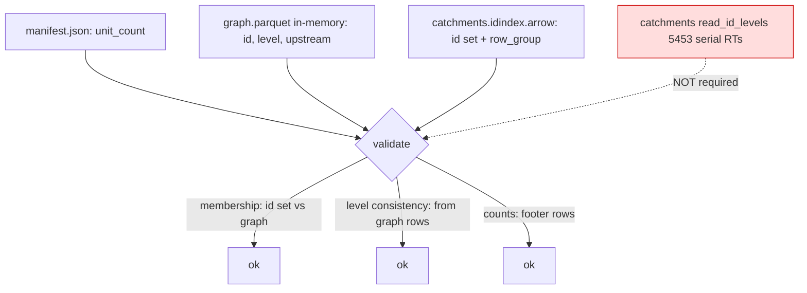

# R2 HFX v0.2.1 Open Reuse — Cold/Warm Diagnosis

Date: 2026-06-06
Owner: shed (reader/session). HFX on-disk format is fine and must not change.
Scope: remote (R2) open of GRIT v2.0.0 (`grit-global-2.0.0`).

## Executive Verdict

Warm open re-scans because the open path never trusts the cache for `(id, level)`. On
the **current source**, the validation-skip fast path is gated by `snap_stores.len() <= 1`
(`crates/core/src/session.rs:446`), and GRIT v2.0.0 declares **two** snaps
(`snap_segments` + `snap_reaches`), so `validation_hit` is *always false* and every open
runs full `validate_graph_catchments()` → a **serial** `read_id_levels()` scan over
**5,453 catchment row groups** plus a full snap-geometry scan over **20.5M** reach refs.
Even the validation-HIT branch (single-snap datasets) still calls `read_id_levels()` to
materialize the whole `UnitId→Level` map (`session.rs:455-467`), so the sidecar HIT never
actually avoids the scan. The persisted `catchments.idindex.arrow` cannot help: it stores
only `ids` + `row_group`, **no levels** (`crates/core/src/reader/id_index.rs:24-28`).

Cold-first verdict: the first open is bounded by a **serial** per-row-group remote read in
`read_id_levels_async` (no `buffered()`); ~5,453 sequential round-trips. The installed
`pyshed 0.2.0rc3` warm open did **not complete within a 190 s hard timeout** even with the
full cache present (idindex + graph + validated.json). The id-index *build*
(`read_all_ids_with_row_groups_async`) IS parallel (concurrency 16), which is why the
273 MB idindex got written, but `read_id_levels` is not.

The decisive fix is cheap: the in-memory `graph` already carries `(id, level)` for every
unit, so `catchment_levels` can be derived from the graph with **zero** catchments I/O.

## Q1 — Why does open re-scan despite cached id-index + validated.json?

### IdIndex load: called, but cannot supply levels
`read_or_build_id_index` (`crates/core/src/reader/catchment_store.rs:1501`) calls
`IdIndex::load_from_path` only when both `id_index_path` and a `file_etag` are present
(`catchment_store.rs:1513-1514`). On R2 the HEAD returns an ETag, so the cached idindex
*does* load and the id→row_group map is reused for windowed geometry queries. **But the
idindex only stores `ids` + `id_row_groups`** (`id_index.rs:24-28`, schema at
`id_index.rs:112-115`). It carries **no `level` column**. So it is structurally incapable
of satisfying `read_id_levels()`. The id-index is therefore *not* the re-scan source — it
loads fine and is reused for row-group windowing; the re-scan is the *level* read.

### The warm re-scan: `read_id_levels()` on every open
- On **sidecar HIT** (single-snap datasets), `session.rs:455-467` still calls
  `catchments.read_id_levels()` and builds the full `UnitId→Level` HashMap. The comment
  even admits it: "A validated sidecar skips membership validation, but the session still
  materializes catchment IDs for query-time checks outside validation." So even a HIT pays
  the full `[id,level]` scan.
- On **sidecar MISS** (the GRIT v2.0.0 case), `validate_graph_catchments()`
  (`session.rs:952`) calls `catchments.read_id_levels()` at `session.rs:967` and then does
  membership + level-consistency + snap-ref validation. No skip-on-valid-sidecar fast path
  exists for the multi-snap case.

### Why GRIT v2.0.0 is ALWAYS a MISS (two compounding reasons)
1. **Two snaps.** `manifest.json` declares `aux/snap_segments.parquet` (level 0) and
   `aux/snap_reaches.parquet` (level 1). The fast-path guard is
   `snap_stores.len() <= 1 && validation_sidecar_matches(...)` (`session.rs:446-453`). With
   two snaps the first conjunct is false, so `validation_hit` is false regardless of the
   sidecar. This is a latent bug: the deferred warm-reuse work never engages for the one
   dataset that needs it most.
2. **Stale version token.** The cached `validated.json` carries `"shed_version":"0.1.0"`,
   and `ValidationSidecar::matches()` requires `self.shed_version == CARGO_PKG_VERSION`
   (`crates/core/src/cache.rs:254`). So even single-snap, the token would currently fail.

### `read_id_levels` does NOT use the persisted id-index
`read_id_levels_async` (`catchment_store.rs:736-806`) builds a fresh
`ParquetRecordBatchStreamBuilder` and re-reads the `[id, level]` projection from parquet
column data across all row groups. It never consults `IdIndex`.

### Measurements (Q1)

| Item | Value | Type |
|---|---|---|
| Cached `catchments.idindex.arrow` | 273,632,694 B, 22,337,300 ids, distinct row_groups = 5,453 | measured (Arrow IPC read) |
| idindex level column present? | No (`id`,`row_group` only) | measured (`id_index.rs:112-115`) |
| `validated.json` shed_version | `0.1.0` (≠ current crate version) | measured |
| Snap declarations in manifest | 2 (`snap_segments` L0, `snap_reaches` L1) | measured |
| `validation_hit` for GRIT v2.0.0 | always false (len() ≤ 1 guard) | computed from `session.rs:446` |

## Q2 — Is the first cold scan serial or parallel? Round-trip count

Two different scans, two different concurrency profiles:

- **id-index build** `read_all_ids_with_row_groups_async` (`catchment_store.rs:1359-1380`):
  **parallel**, `.buffered(ID_INDEX_ROW_GROUP_CONCURRENCY)` with
  `ID_INDEX_ROW_GROUP_CONCURRENCY = 16` (`catchment_store.rs:43`). This is what populated
  the 273 MB cache.
- **`read_id_levels_async`** (`catchment_store.rs:760-803`): **SERIAL**. A plain
  `for (row_group, …) in selected_row_groups` loop, each iteration building a stream and
  awaiting `next_row_group()` one at a time. **No `buffered()`.** This is the cold/warm
  re-scan that blocks.
- **snap-ref scan** `read_all_snap_refs_from_store_async` (`snap_store.rs:695`): parallel
  (`buffered(16)`), but it projects `id, unit_id, geometry, stem_role`
  (`snap_store.rs:670-676`) — i.e. it reads **full snap geometry** for every snap row on
  every non-validated open.

### Round-trip count (catchments `[id,level]` serial scan)

| Quantity | Value | Type |
|---|---|---|
| catchments.parquet row groups | 5,453 | measured (graph footer + idindex distinct rg) |
| catchments units | 22,337,300 | measured |
| `read_id_levels` round-trips | ≈ 5,453 serial (1 projected column-chunk fetch per RG, sequential) | computed |
| Serial-scan lower bound @ 30 ms RTT | ≈ 164 s | computed |
| Serial-scan lower bound @ 60 ms RTT | ≈ 327 s | computed |
| Warm open (pyshed 0.2.0rc3, full cache present) | **did not complete in 190 s** | timed out (hard) |

Because the level scan is serial, the per-round-trip latency multiplies directly by 5,453.
This is the dominant reason the first (and every) open is unusable on the large remote
dataset. The parallel id-index build (concurrency 16) is ~16× cheaper per the same RG count,
which is why the idindex completed and got cached while the open as a whole did not.

> Note: the installed wheel is `0.2.0rc3`, which predates the current-source
> `validation_hit` branch. Its >190 s warm timeout is consistent with the current-source
> analysis (multi-snap → always MISS → serial level scan + full snap-geometry scan).

## Q3 — Can referential integrity be validated WITHOUT a full catchments `[id,level]` scan?

**Yes — the full column scan is not required.** Each check's true input:

| Integrity check (in `validate_graph_catchments`) | What it actually needs | Available without catchments scan? |
|---|---|---|
| unit-count (`session.rs:957-964`) | `manifest.unit_count` vs `catchments.total_rows()` | Yes — row count is in the parquet footer (already read) |
| graph.len == catchment count (`session.rs:978`) | counts only | Yes — graph in-memory + footer rows |
| graph membership / dangling-upstream (`session.rs:988-1021`) | the **id set** of catchments | Yes — `catchments.read_all_ids()` already returns the cached id set (`catchment_store.rs:719-721`), populated from the persisted idindex; no level scan needed |
| level consistency: `row.level() == catchment.level` (`session.rs:1002`, `:1027`) | per-unit level | **Yes — from the graph itself** |
| catchment→graph reverse membership (`session.rs:1041-1050`) | id set | Yes — id set + graph index |
| snap refs valid (`validate_snap_refs`, `session.rs:1061`) | `unit_id → level` lookup + the snap unit_id set | level lookup from graph; the snap geometry projection is unnecessary for ref validation |

The linchpin: **`graph.parquet` carries `(id, level)` for every unit and is fully parsed
into the in-memory `DrainageGraph` at open.** `AdjacencyRow` in the pinned
`hfx-core 0.2.64` exposes `id()`, `level()`, `upstream_ids()`
(`hfx-core .../graph.rs:29,34,39`), and shed's graph reader reads the `level` column for
every row (`crates/core/src/reader/graph.rs:167-177`,
`AdjacencyRow::new(id, level, upstream_ids)` at `graph.rs:176`).

Consequently the catchment-side `level` is **redundant** with the graph. Level consistency
collapses to "graph self-consistent" plus "catchment id set == graph id set" (already
checkable from the idindex id set). The only thing the catchments file uniquely contributes
to *open-time validation* is its **id set**, which the persisted idindex already provides.

Row-group statistics are a fallback (graph `level` min/max stats already wired:
`graph.rs:103` `max_level_from_row_group_statistics`), but they are **not needed** here
because the graph is loaded in full anyway. Avoid trusting catchment row-group stats for
level *equality* (stats only bound min/max per group, cannot prove per-row equality).

## Q4 — Fix Options (design only)

Two prongs. Prong (b) carries the win for the *first* open; prong (a) makes every open free.

### (a) WARM reuse — make a sidecar-present open skip the `[id,level]` scan, soundly
Root realization: there should be **no separate `catchment_levels` map at all** for the
multi-snap case. The query-time consumers need only:
- `max_level()` (`session.rs:586`) → set of levels.
- `level_of(unit_id)` (`session.rs:571`) → used by resolver candidate filtering
  (`resolver.rs:373`) and same-level traversal invariant (`engine.rs:603`).

Both are derivable from the already-loaded graph: `level_of(id)` ≡
`session.graph().get(id).map(|r| r.level())`; `max_level()` ≡ max over `graph.rows()` (or
the wired row-group stats). So warm reuse = **delete the `read_id_levels()` materialization**
and serve level lookups from the graph. No persisted level map is even needed; the graph is
always cached and parsed.

Soundness: this is *more* sound than the status quo, because today catchment-level and
graph-level are validated equal only when a scan runs; serving from the graph makes the
graph the single source of truth. Membership still needs the catchment id set — keep using
`read_all_ids()` (idindex-backed) for that, gated by the existing etag/size/version token so
a changed dataset revalidates.

Also fix the gating bug: the `snap_stores.len() <= 1` guard (`session.rs:446`) must not be
the thing that disqualifies multi-snap datasets from the fast path. Drive the fast/slow
decision off the validity token (etag+size+version, possibly +format_version), not snap
arity.

### (b) COLD / FIRST open — make the first open complete in a stated reasonable time
1. **Parallelize `read_id_levels_async`** (or eliminate it per prong (a)). If any catchment
   column read at open survives, give it `.buffered(16)` like the id-index build
   (`catchment_store.rs:1378`). 5,453 RTs at concurrency 16 ≈ 341 serialized batches → tens
   of seconds, not minutes.
2. **Eliminate the open-time level scan entirely** by deriving levels from the graph
   (prong a). Then the only O(N) catchment work at first open is the id-index build, which
   is already parallel and already cached after the first run.
3. **Avoid the full snap-geometry scan in `validate_snap_refs`.** It projects `geometry`
   (`snap_store.rs:670`) only to validate refs; project `id`/`unit_id` only, or validate
   snap unit_ids against the catchment/graph id set without reading geometry.

### RECOMMENDED smallest combination
Adopt **prong (a)'s "derive levels from the graph"** as the core change, which *also*
resolves the cold case:

1. Replace the `catchment_levels: HashMap<UnitId, Level>` materialization with graph-backed
   `level_of` / `max_level` (delete both `read_id_levels()` call sites at `session.rs:464`
   and `session.rs:967`).
2. Validate membership from the idindex-backed id set (`read_all_ids()`) + graph; validate
   level consistency from the graph alone.
3. Stop projecting `geometry` in the snap-ref validation scan; or skip it under a matching
   validity token.
4. Decouple the warm fast-path from snap arity; gate on the validity token only, and refresh
   the stale `shed_version` token semantics.

**Which prong carries the win:** prong (b) via change #1 — removing the 5,453-RT serial
level scan is what turns the first open from ">190 s / never" into "id-index build only".
Prong (a) then makes every subsequent open pay essentially nothing for levels.

**Soundness notes:** (i) Do not trust catchment row-group stats for per-row level equality.
(ii) The graph becomes the single source of truth for level — acceptable because the writer
guarantees graph/catchment level agreement per HFX, and open already loads the graph in
full. (iii) Keep the etag+size+version token as the membership-revalidation trigger so a
changed catchments file still forces an id-set rebuild.

## Regression-Proof Hook

The instrumented proof must assert the OLD code enters the **serial catchment level scan**
on a warm, fully-cached remote open:

- Path to assert entry: `CatchmentStore::read_id_levels` /
  `read_id_levels_async` (`catchment_store.rs:732`/`:736`) — reached from both
  `validate_graph_catchments` (`session.rs:967`) and the validation-HIT branch
  (`session.rs:464`).
- Suggested counter: a test-only call counter on `read_id_levels_async` (mirroring the
  existing `geometry_decode_count_for_test` machinery at `catchment_store.rs:1294`), or a
  tracing-span assertion that the `[id,level]` projection scan executes when a valid sidecar
  + idindex are present. The test should open twice (warm cache) and assert the level scan
  count is **> 0** on the old code and **0** after the fix.
- For the multi-snap gating bug specifically, assert that with two snap declarations the
  `validation_hit`/skip branch is bypassed today (so `read_id_levels` runs), and that the
  fixed code does not run it.

## Appendix — Cache + dataset facts (measured)

| Fact | Value |
|---|---|
| Cache dir | `/Users/nicolaslazaro/Library/Caches/hfx/grit/grit-global-2.0.0/` |
| `catchments.idindex.arrow` | 273,632,694 B; 22,337,300 ids; 5,453 distinct row groups |
| `graph.parquet` (cached) | 699,720,490 B; 22,337,300 rows; 5,453 row groups; cols id,level,upstream_ids,bbox* |
| `validated.json` | catchments etag `…-3876`, size 32,508,030,585; snap etag `…-439`, size 3,674,756,917; shed_version `0.1.0` |
| snaps | `snap_segments` (L0, 1,767,065 refs), `snap_reaches` (L1, 20,570,235 refs) |
| Installed wheel | `pyshed 0.2.0rc3` |
| Warm open (rc3, full cache) | did not complete within 190 s hard timeout |
