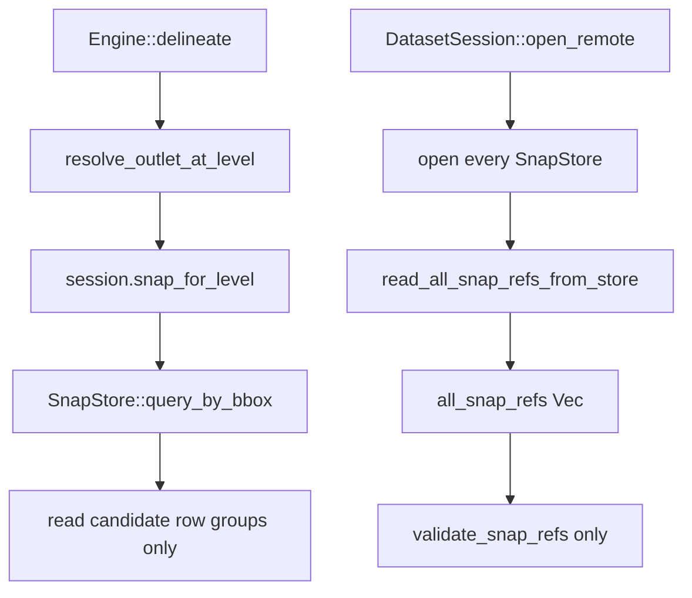

# R2 Snap Open Reuse Investigation

Date: 2026-06-06
Owner: shed reader/session
Scope: snap-store open-time scan in `shed-core`. HFX format and GRIT adapter are fine.

## Executive Verdict

The snap open blocker is real in current source. Remote `DatasetSession::open_remote`
constructs every declared `SnapStore` before it computes `validation_hit`
(`crates/core/src/session.rs:452-493`). Each `SnapStore::open_remote_with_caches`
enters `SnapStore::open_object`, and `open_object` unconditionally calls
`read_or_build_id_index` (`crates/core/src/reader/snap_store.rs:263-373`).
That helper loads a cached id-index only to reject it for snap-store needs, then always
runs `read_all_snap_refs_from_store` (`snap_store.rs:579-637`).

That "id index" read is not lean. It projects `id`, `unit_id`, `geometry`, and optional
`stem_role` over all row groups (`snap_store.rs:673-699`), decodes every geometry, validates
Point/LineString, parses every non-null `stem_role`, and retains only
`Vec<SnapUnitRef> { snap_id, unit_id }` (`snap_store.rs:122-130`, `:833-869`). On GRIT
v2.0.0, that means 22.34M snap rows across 5,453 snap row groups before the token can be
trusted or ignored.

Query-time delineation does not need this eager full list. The hot snap path selects a
level-matching store and uses a windowed bbox query (`resolver.rs:751-756`,
`resolver.rs:341-352`). The full `all_snap_refs` list is consumed only by open-time
referential validation (`session.rs:1107-1116`) and by the currently unused public
`read_all_unit_ids()` accessor (`snap_store.rs:512-521`).

Recommended smallest sound fix: make warm token-valid remote opens skip snap full scans
entirely by deciding validation reuse before opening full snap stores, and represent
snap stores lazily enough for query-time bbox reads. For cold/invalidated opens, keep
the current geometry and `stem_role` detection, but separate it from membership: validate
membership from a lean `[id, unit_id]` pass or a persisted snap-pair index, and run the
geometry/stem-role validation once only when the artifact token is cold or stale.

## 1. Why The Eager Scan Happens Before Token Check

Remote open order is the root cause:

- `session.rs:441-450` opens `catchments.parquet`.
- `session.rs:452-473` iterates `aux_declarations.snaps` and opens every `SnapStore`.
- Only after those stores exist does `session.rs:475-493` gather artifact metadata and
  compute `validation_hit`.
- The warm branch at `session.rs:495-499` therefore cannot prevent the snap-store open
  scan; the expensive scan has already completed or timed out.

Inside the snap store, the cache does not supply what `SnapStore` wants:

- `SnapStore::open_object` validates schema and row-group bboxes, then calls
  `read_or_build_id_index` at `snap_store.rs:363-373`.
- `read_or_build_id_index` loads `IdIndex` only to rebuild. If the cached index has no
  `id_row_groups`, it logs "lacks snap ids; rebuilding" (`snap_store.rs:579-587`). If it
  has row groups, it logs "has row groups; rebuilding" (`snap_store.rs:588-593`).
- The persisted `IdIndex` schema is only `id: Int64` and nullable `row_group: Int32`
  (`crates/core/src/reader/id_index.rs:111-115`). The struct stores `ids: Vec<UnitId>`
  and optional `id_row_groups: HashMap<UnitId, usize>` (`id_index.rs:24-28`).
- For snap stores, the writer persists only `unit_id` values, not `snap_id -> unit_id`
  pairs (`snap_store.rs:623-627`). A cached snap id-index can therefore prove a unit-id
  list, but it cannot reconstruct `SnapUnitRef { snap_id, unit_id }`.

### Measurements

| Evidence | Value | Type |
|---|---:|---|
| GRIT cached `aux/snap_reaches.idindex.arrow` | 251,986,165 B | measured |
| GRIT cached `aux/snap_segments.idindex.arrow` | 21,647,349 B | measured |
| `IdIndex` columns | `id`, `row_group` only | computed from `id_index.rs:111-115` |
| Snap pair persisted? | No; snap writer stores `snap_ref.unit_id` only | computed from `snap_store.rs:623-627` |
| Token-check order | after all snap stores open | computed from `session.rs:452-493` |

## 2. What Query Time Actually Needs

The engine's delineation path goes through outlet resolution, not the eager ref list:

- `Engine::delineate` selects a level and calls `resolve_outlet_at_level`
  (`crates/core/src/engine.rs:891-900`).
- `Engine::resolve_outlet_at_level` delegates to the resolver (`engine.rs:565-572`).
- The resolver selects the snap store for the selected level (`resolver.rs:745-756`).
- The snap resolver builds a search bbox and calls `snap_store.query_by_bbox(&bbox)`
  (`resolver.rs:341-352`).
- `query_by_bbox` prunes row groups by bbox stats and reads only candidate row groups
  with `SNAP_BBOX_ROW_GROUP_CONCURRENCY` (`snap_store.rs:411-486`).

Consumers of the full-list APIs:

- `all_snap_refs` is a field on `SnapStore` (`snap_store.rs:159`) populated at open
  (`snap_store.rs:363-392`).
- `read_all_snap_refs()` simply clones that field (`snap_store.rs:520-521`) and is only
  called by `validate_snap_refs` (`session.rs:1115`).
- `read_all_unit_ids()` maps over the same field (`snap_store.rs:512-517`). Current source
  references are only its own test (`snap_store.rs:1617`, `:1677-1678`).
- `read_all_snap_refs_from_store*` is only called by `read_or_build_id_index`
  (`snap_store.rs:613-620`).
- `query_by_bbox()` is used by the resolver hot path (`resolver.rs:352`) and snap tests.

So the hot delineation path needs a schema-validated, metadata-backed, bbox-queryable
snap store. It does not need `all_snap_refs` materialized at open.

### Measurements

| Evidence | Value | Type |
|---|---|---|
| `rg` references to `read_all_snap_refs` outside snap store | one production caller: `validate_snap_refs` | measured |
| `rg` references to `read_all_unit_ids` outside snap store | none in production | measured |
| Hot snap path full-list use | none; uses `query_by_bbox` | computed from `engine.rs` + `resolver.rs` |

## 3. What Cold Referential Validation Needs

`validate_snap_refs` itself only checks membership and declared levels:

- It records the test counter at `session.rs:1112-1113`.
- It clones `snap_store.read_all_snap_refs()` at `session.rs:1115`.
- For each pair, it checks `unit_id` exists in `catchment_levels` and the level is listed
  in the snap declaration's `references_levels` (`session.rs:1116-1135`).

The current snap scan conflates two jobs:

1. Build `snap_id -> unit_id` pairs and check `snap.unit_id` belongs to the validated
   catchment/graph id set and declared level set.
2. Validate snap geometry and `stem_role`: null geometry rejection, WKB decode,
   Point/LineString enforcement, and `StemRole` parsing (`snap_store.rs:833-868`;
   `validate_snap_geometry` at `snap_store.rs:1162-1179`; error variants at
   `crates/core/src/error.rs:235-267`).

For job 1, geometry is not required. A lean `[id, unit_id]` projection, or a persisted
snap-pair index keyed by artifact ETag+size, is enough. For job 2, geometry is
fundamentally required because the validator must decode the WKB to prove the row is a
Point or LineString. That job is required on cold/first or token-invalidated opens if shed
keeps current detection guarantees, but it is not required on a warm open whose validation
token attests manifest, graph, catchments, and every snap by ETag+size and validation logic
version.

### Measurements

| Evidence | Value | Type |
|---|---|---|
| Membership check reads geometry? | No; `validate_snap_refs` uses only `snap_id`, `unit_id`, level map | computed |
| Geometry validation requires geometry bytes? | Yes; `decode_wkb` + geometry type check | computed |
| Current retained full-scan output | only `SnapUnitRef { snap_id, unit_id }` | computed |
| Existing cold detection | invalid stem role and invalid snap geometry are explicit errors | computed from `error.rs:235-267` |

## 4. Cost And Shape

The full snap open scan reads every row group with `.buffered(16)`:

- `read_all_snap_refs_from_store_async` selects all row groups (`snap_store.rs:698-699`).
- It uses `ID_INDEX_ROW_GROUP_CONCURRENCY` in `.buffered(...)` (`snap_store.rs:710-724`).
- For each row group, it reads the projection and validates rows in batches of 8192
  (`snap_store.rs:747-868`).

For GRIT v2.0.0, the remote snap footers show:

| Snap file | Rows | Row groups | File size | Full current projection compressed | Lean `[id,unit_id]` compressed |
|---|---:|---:|---:|---:|---:|
| `aux/snap_reaches.parquet` | 20,570,235 | 5,022 | 6,478,990,670 B | 6,006,106,525 B | 227,829,550 B |
| `aux/snap_segments.parquet` | 1,767,065 | 431 | 3,674,756,917 B | 3,628,851,297 B | 20,006,663 B |
| Total | 22,337,300 | 5,453 | 10,153,747,587 B | 9,634,957,822 B | 247,836,213 B |

The full current projection is `id + unit_id + geometry + stem_role`. A lean membership
projection is `id + unit_id`. On GRIT, the full projection is about 38.9x the compressed
bytes of the lean membership projection. Geometry alone accounts for about 9.39 GB
compressed across the two snap files.

Local proxy (`merit-hfx-global`) has the same shape at smaller scale:

| File | Rows | Row groups | Full current projection compressed | Lean `[id,unit_id]` compressed |
|---|---:|---:|---:|---:|
| `aux/snap_stems.parquet` | 2,876,771 | 702 | 1,781,753,336 B | 32,657,707 B |

### Measurements

| Evidence | Value | Type |
|---|---:|---|
| GRIT remote HEAD `snap_reaches` | size 6,478,990,670 B, ETag `"abf5...-773"` | measured with hard-timeout `curl -sI` |
| GRIT remote HEAD `snap_segments` | size 3,674,756,917 B, ETag `"c434...-439"` | measured with hard-timeout `curl -sI` |
| GRIT remote footer metadata | rows, row groups, column compressed bytes above | measured with hard-timeout `pyarrow` + `fsspec` |
| GRIT warm open behavior | did not complete within 45 s; output JSONL remained empty | timed out with hard-timeout bench command |
| Local MERIT snap-store warm traces | `snap_store_open` 7,914.5 ms and 7,919.6 ms; `snap_id_index` 7,911.6 ms and 7,917.4 ms | measured from `/tmp/shed-merit-local-open-{1,2}-trace.jsonl` |
| Local MERIT current projection bytes | 1,781,753,336 B | measured with `pyarrow.parquet` metadata |
| Local MERIT lean `[id,unit_id]` bytes | 32,657,707 B | measured with `pyarrow.parquet` metadata |

## 5. Fix Options

### (a) Warm: skip snap full scan under a valid token

This is the high-leverage prong. A valid token already represents a prior successful cold
validation of manifest, graph, catchments, and snaps. Current `ValidationSidecar` is the
right shape: token format version, validation logic version, HFX format version, manifest,
graph, catchments, and sorted `snaps` metadata (`crates/core/src/cache.rs:33-63`,
`:271-309`). `ArtifactMeta::from_parts` refuses missing ETags (`cache.rs:72-83`), so
token matching fails closed when a backend cannot provide ETag.

The implementation shape should move token-input metadata collection before full snap
opening. On a token hit, construct snap handles that have footer/schema/bbox metadata
needed for `query_by_bbox`, but do not call `read_all_snap_refs_from_store` and do not
materialize `all_snap_refs`. A changed snap file changes path/ETag/size and forces cold
validation.

### (b) Cold/first: make first open complete

Cold validation still needs two snap passes conceptually:

- Membership: use a lean `[id, unit_id]` projection or a persisted snap-pair index. This
  avoids reading ~9.39 GB of compressed geometry on GRIT just to check referential
  integrity.
- Geometry/stem-role detection: keep the current full validation behavior on cold or
  token-invalidated opens. It may still be expensive, but it runs once per artifact token
  and then writes the sidecar.

Persisting a snap-pair index should store both `snap_id` and `unit_id`, keyed by snap
artifact ETag+size and validation logic. Do not reuse the current `IdIndex` schema for
this without extending it; it stores only `UnitId` plus optional row group.

### (c) Lazy: stop materializing `all_snap_refs` at open

This matches actual query-time needs. `SnapStore` can remain a lazy parquet reader with
row-group bbox pruning, and `read_all_snap_refs()` can become a cold-validation-only path
or disappear behind a validator helper. The main thing that breaks is any caller expecting
`read_all_unit_ids()` or `read_all_snap_refs()` to be cheap after open. Current production
code does not rely on that, but tests will need to be adjusted to assert the validator path
explicitly.

### Recommended Smallest Combination

Implement (a) plus the lazy part of (c), with a narrow cold fallback from (b):

1. Compute validation-token inputs before any full snap scan.
2. On token hit, open snap stores lazily for bbox query and skip `read_all_snap_refs_from_store`
   entirely.
3. On token miss, run cold validation. Split membership into a lean `[id, unit_id]` pass or
   persisted snap-pair index; preserve geometry and `stem_role` validation before writing
   the token.
4. Remove eager `all_snap_refs` materialization from normal `SnapStore::open`.

Which prong wins: warm skip carries the decisive GRIT remote-open win. Cold splitting is
still important so first open can finish and create the reusable token, but the current
user-visible failure is that even warm, cache-present opens enter the full snap geometry
scan before checking the token.

Soundness risks:

- Dropping cold geometry validation would weaken existing behavior. Do not do that without
  an explicit human decision and test changes.
- Trusting a persisted snap-pair index is sound only when keyed by snap path, ETag, size,
  token format, and validation logic version. Size-only matching is not sound.
- HFX v0.2.1 Hilbert sorting is not the blocker. It can improve bbox pruning tightness for
  query-time reads, but open time is blocked by an eager all-row scan.

## 6. Regression-Proof Hook

The real old path to prove is:

`DatasetSession::open_remote` second warm open with a valid token -> `SnapStore::open_remote_with_caches`
-> `SnapStore::open_object` -> `read_or_build_id_index` -> `read_all_snap_refs_from_store_async`
-> `read_snap_refs_row_group_async` -> `geometry_from_array` / `validate_snap_geometry`.

An instrumented test should open a remote in-memory fixture twice, reset counters after the
first open, and assert the old code enters the snap full scan on the second token-valid
open. After the fix, the same test should assert zero full-scan row groups and zero geometry
decodes before query time.

Reusable hooks:

- Existing `snap_validation_scan_count_for_test` records calls to `validate_snap_refs`
  (`session.rs:133-148`, `:1112-1115`). It proves the validation function is skipped, but
  it does not catch the earlier snap-store open scan by itself.
- `SnapValidationReadStats` already counts `batches_read`, `rows_validated`,
  `stem_role_values_parsed`, and `geometry_rows_validated` (`snap_store.rs:128-145`,
  `:727-743`). Expose a test-only counter at `read_all_snap_refs_from_store_async` or
  `read_snap_refs_row_group_async` so the regression hits the real geometry-decode path.

The test should fail before the fix because a warm token-valid open still performs
`geometry_rows_validated > 0` during `snap_store_open`; it should pass after the fix with
`geometry_rows_validated == 0` until a query or cold validation explicitly requests it.

## Results

Measured on 2026-06-06 against GRIT v2.0.0 R2 after the catchment cold-pass merge and
64-way lean-validation row-group scheduling.

| Metric | Before | After | Target |
|---|---:|---:|---:|
| Cold open total, including graph floor | 537 s | 178.0 s | <= 240 s target, <= 300 s escalation |
| Graph fetch and parse floor | ~70 s | 54.9 s | Reported separately |
| Catchment id-index pass | separate cold pass | merged into `[id, level]` pass; telemetry 52.6 s | No separate second scalar pass |
| Catchment validation | 139 s | 5.5 s | Lean scans included below |
| Snap membership validation | 141 s | 54.1 s | Lean scans included below |
| Cold lean validation scans | ~280 s visible validation cost | 59.6 s | <= 90 s target, <= 120 s escalation |
| Warm open | 9.77 s | 9.37 s | <= 12 s |

Cold correctness gates held: snap membership rows were read (`22,337,300`), snap geometry
decode rows were `0`, and catchment geometry decode rows were `0`. The catchment and snap
lean readers both reached the scheduler bound of `64` in-flight row groups; this is a shed
scheduler gauge, not a claim about effective HTTP connection concurrency.

Warm correctness gates held: `token_hit=true`, catchment level scans `0`, snap validation
scans `0`, snap membership rows `0`, and snap geometry decode rows `0`. The remaining warm
cost is the cache-I/O floor: cached graph disk read/parse was measured at about `2.35 s`,
plus persisted id-index/cache reads, snap metadata open, and token HEADs.
