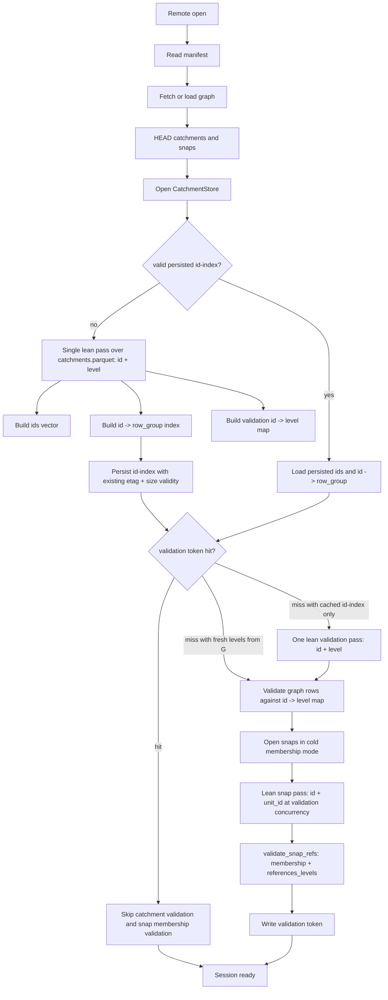

# R2 Cold Open Speedup Step Plan

Date: 2026-06-06
Owner: shed reader/session
Scope: surgical `shed-core` reader/session changes for the R2 Open Reuse cold-open performance add-on. Source/tests/config are read-only for this planning pass; this document is the only file written. HFX format/adapter changes, graph/id-index load-format work, Hilbert, D8, eager delineation, M3/M4/M5, M1 goldens beyond fallout gates, and `pyshed` versioning are out of scope.

## Executive Summary

Real-R2 measurement at current dirty HEAD `v0.1.177-dirty` shows the snap and catchment soundness fixes are correct, but cold open is latency-bound:

- Cold total: about **537 s**.
- `catchment_id_index`: not reported by the dirty harness yet, but it is a distinct telemetry stage and is the likely missing part of the 537 s breakdown. Step 1 must add it to the JSON before using the cold math for attribution.
- `validate_graph_catchments`: about **139 s**.
- Snap membership lean read: about **141 s** for only about **248 MB**, roughly **1.8 MB/s effective**, which indicates row-group/request latency at `.buffered(16)`, not bandwidth.
- Graph fetch: about **70 s** for a one-time **700 MB** download at roughly **10 MB/s**. This is a bandwidth floor and is explicitly not optimized here.
- Warm total: **9.77 s**, with validation correctly skipped: catchment id/level scans `0`, snap validation scans `0`, snap membership rows `0`, snap geometry decode rows `0`. The remaining warm cost is local cache I/O: cached graph disk read and parse, graph parse floor about **2.4 s**, persisted **273 MB** id-index read, and token HEADs.

There are two locked levers:

1. Merge the cold catchment id-index pass and catchment level-validation pass into one `[id, level]` pass when the id-index is built from remote Parquet. Today `CatchmentStore` builds `id -> row_group` by scanning `[id]`, then `validate_graph_catchments` separately scans `[id, level]`. On a true cold cache miss over the 32.5 GB / 5,453-row-group remote catchment file, that is two full scalar-column passes.
2. Raise full-file lean validation concurrency above `16` for latency-bound validation reads only. Chosen value: **64** via renamed `LEAN_VALIDATION_ROW_GROUP_CONCURRENCY` constants. Keep hot-path bbox/candidate reads on their existing knobs.

Chosen concurrency value: **64**.

Rationale:

- The measured snap membership pass reads only about 248 MB but takes about 141 s at concurrency 16, so the limiting factor is per-row-group latency and request scheduling, not byte throughput.
- 64 is a 4x increase in in-flight row groups, which is the smallest aggressive step likely to expose enough parallelism across 5,453 row groups without turning the run into unbounded request fan-out.
- The max-in-flight gauges prove the `buffered()` bound inside shed, not the number of active HTTP requests. The object-store HTTP client may cap connections or multiplex below 64; Step 4's real-R2 re-measure is the proof that the win actually lands.
- Memory risk is bounded because both target readers project only scalar columns: catchment `[id, level]` and snap `[id, unit_id]`. Each in-flight row group holds decoded Arrow batches and compressed/read buffers, but not geometry WKB columns.
- This must not bump `GEOMETRY_QUERY_ROW_GROUP_CONCURRENCY` in `crates/core/src/reader/catchment_store.rs:46` or `SNAP_BBOX_ROW_GROUP_CONCURRENCY` in `crates/core/src/reader/snap_store.rs:87`; small bbox candidate windows should stay conservative.
- If R2 returns 429s, elevated tail latency, or connection-level throttling at 64, fall back to 48 and record the reason in `clog problem`.

Expected cold improvement:

- The one-time graph download floor remains about **67-70 s** and is reported separately.
- The merge removes the separate cold `catchment_id_index` `[id]` pass; the concurrency change speeds the remaining lean validation scans (`validate_graph_catchments` and snap membership). Keep those effects separate in measurement: `catchment_id_index_ms` should collapse into the merged catchment pass on id-index miss, while the roughly **280 s** visible validation lean-scan cost should move toward the 64-way-overlap time. Realistic target is **cold validation lean scans <= 90 s** and **cold total <= 240 s including the one-time graph download floor** on the same network. Escalate if total stays above **300 s** or validation lean scans stay above **120 s** after 64-way concurrency and the merged pass.

Warm handling:

- Do not optimize graph load/parse or the id-index read format.
- Re-baseline warm to the measured local cache-I/O floor: cached 700 MB graph disk read and parse, graph parse floor about **2.4 s**, persisted 273 MB id-index read, and token HEADs.
- Warm is effectively met-at-floor because validation is already skipped. The harness should keep reporting floor components separately and assert against a derived target: **measured floor + variance margin**, initially **12,000 ms** from the observed 9.77 s warm run plus margin, not the previous 9,000 ms target.

## Merged Cold Path

Design constraints:

- The persisted id-index remains `ids` plus `id_row_groups`, validated by ETag and size. Do not persist level maps inside `IdIndex`.
- When the id-index is rebuilt cold, the same `[id, level]` pass must produce the id vector, `id -> row_group`, and an in-memory `id -> level` validation map.
- When the id-index cache hits but the validation token misses, no id-index rebuild occurs; validation must perform exactly one `[id, level]` pass and use that map. This is still one pass, not the current two-pass cold miss.
- The M2 equality check in `validate_graph_catchments` must keep rejecting graph/catchment level mismatch.

## Current Anchors

- Concurrency constants: `crates/core/src/reader/catchment_store.rs:45-46`, `crates/core/src/reader/snap_store.rs:86-87`.
- Current catchment `[id, level]` validation reader: `crates/core/src/reader/catchment_store.rs:743-814`.
- Catchment id-level test counters and in-flight gauge: `crates/core/src/reader/catchment_store.rs:1405-1423`.
- Current id-index `[id]` async reader: `crates/core/src/reader/catchment_store.rs:1441-1531`.
- Current id-index cache load/write boundary: `crates/core/src/reader/catchment_store.rs:1625-1665` and following write branch.
- Current graph/catchment validation call: `crates/core/src/session.rs:1010-1058`.
- Local open validation call: `crates/core/src/session.rs:281-284`.
- Remote token-miss validation block: `crates/core/src/session.rs:516-535`.
- Snap lean membership reader concurrency: `crates/core/src/reader/snap_store.rs:699-727`.
- Dirty ignored measurement harness: `crates/core/src/session.rs:2639-2778`.
- Existing token-skip/revalidation tests: `crates/core/src/session.rs:2597-2636`, `crates/core/src/session.rs:2895-2970`, `crates/core/src/session.rs:2982-3074`.
- External M2 level mismatch regression named by the request exists as `crates/core/tests/graph_parquet_reader.rs:150`; current session-level mismatch helpers are in `crates/core/src/session.rs:3015-3088`.

## Steps

### 1. Commit the dirty real-R2 measurement harness

Goal: Make the currently uncommitted ignored performance harness durable before changing behavior.

Regression-proof-first:

- No production behavior change.
- Preserve the ignored, env-gated tests already dirty in `crates/core/src/session.rs`: `measure_real_grit_warm_snap_open_reuse` at `session.rs:2639`, `measure_real_grit_cold_snap_membership_open` at `session.rs:2706`, and `measure_local_merit_global_snap_membership_open` at `session.rs:2780`.
- Keep `SHED_R2_SNAP_OPEN_REAL_MEASURE` gating so normal test runs do not hit network or local large fixtures.
- Keep printed JSON fields for elapsed time, stage durations, graph parse floor, scan counters, membership rows, and geometry decode rows.

Change:

- Fold the existing dirty `crates/core/src/session.rs` measurement helpers and ignored tests into a conventional commit.
- Re-baseline the warm assertion in that harness from `9,000 ms` to `12,000 ms`, while separately reporting `graph_parse_floor_ms`, token HEAD behavior, id-index read, and all validation-free counters.
- Add `"catchment_id_index_ms": stage_ms(&stages, "catchment_id_index")` to the cold measurement JSON before interpreting the cold baseline. The dirty harness currently reports `catchment_validate_ms`, `snap_membership_ms`, `graph_fetch_and_parse_ms`, `snap_store_open_ms`, and `validate_snap_refs_ms`; without `catchment_id_index_ms`, the cold breakdown hides the pass that the merge removes.
- Keep cold targets in the harness as reporting plus escalation thresholds; real-R2 numbers are gathered manually.

Gates:

- `cargo test -p shed-core measure_real_grit_warm_snap_open_reuse -- --ignored` skips unless `SHED_R2_SNAP_OPEN_REAL_MEASURE=1`.
- `cargo test -p shed-core measure_real_grit_cold_snap_membership_open -- --ignored` skips unless `SHED_R2_SNAP_OPEN_REAL_MEASURE=1`.
- `cargo test -p shed-core second_remote_open_with_two_snaps_uses_validation_sidecar`.

Version step:

- `./scripts/bump-version.sh patch`
- Stage `crates/core/src/session.rs`, `Cargo.toml`, and `Cargo.lock` if changed.
- Commit: `test(core): persist R2 snap open measurement harness`
- Tag: `git tag v$(grep '^version' Cargo.toml | head -1 | sed 's/.*"\\(.*\\)"/\\1/')`

### 2. Prove and implement the merged catchment cold pass

Goal: On a true cold catchment id-index miss, read catchment scalar columns once with `[id, level]`, and derive both `id -> row_group` and the `id -> level` map consumed by graph validation.

Regression-proof-first:

- Extend test-only catchment scan instrumentation near `crates/core/src/reader/catchment_store.rs:1405-1423` so it records projection shape and full-row-group pass count, not just calls to `read_id_levels`.
- Add a counter on the id-index build path itself: `read_all_ids_with_row_groups_async` at `crates/core/src/reader/catchment_store.rs:1441-1531` currently has no scan counter, so the two-pass proof must instrument both the `[id]` id-index build and the `[id, level]` validation reader.
- Add a failing-before test using a fixture with multiple row groups:
  - Open through the real `CatchmentStore::open` path so the id-index build path runs.
  - Run `validate_graph_catchments` through `DatasetSession::open_path` or a session-level fixture, not a mocked proxy.
  - Assert current code performs two distinct scalar full-file passes: one `[id]` id-index pass from `read_all_ids_with_row_groups_async` and one `[id, level]` pass from `read_id_levels_async`.
  - After the change, assert one `[id, level]` pass and zero separate `[id]` pass for a true cold id-index miss.
- Preserve M2 soundness tests:
  - `graph_row_level_must_match_catchment_level` in `crates/core/tests/graph_parquet_reader.rs:150`.
  - Session-level catchments token swap and graph-only swap revalidation tests around `crates/core/src/session.rs:2982-3074`.
- Add or update assertions that cold open still has catchment geometry decode count `0`.
- Keep warm token-hit proof: `second_remote_open_with_two_snaps_uses_validation_sidecar` must still show catchment level scans `0`, snap scans `0`, snap membership rows `0`, and snap geometry decode rows `0`.

Change:

- In `crates/core/src/reader/catchment_store.rs`, replace the cold id-index reader at `catchment_store.rs:1441-1531` with a merged scalar reader, for example `read_ids_levels_with_row_groups_async`.
- Have the merged row-group worker return `row_group` plus ordered `CatchmentIdLevelRow` values. Build:
  - `Vec<UnitId>` in file order.
  - `HashMap<UnitId, usize>` for `id -> row_group`, preserving duplicate-ID rejection.
  - `HashMap<UnitId, Level>` or ordered `Vec<CatchmentIdLevelRow>` for validation.
- Keep `IdIndex` persistence unchanged: write only ids and row groups using the existing ETag + size validity discipline in `read_or_build_id_index`.
- Add an in-memory validation-level state to `CatchmentStore`, for example `validation_levels_from_open: Option<HashMap<UnitId, Level>>`.
- Change `validate_graph_catchments` at `crates/core/src/session.rs:1010-1058` to obtain the level map from `CatchmentStore`:
  - If the merged cold open produced levels, consume or clone that map with no extra scan.
  - If the persisted id-index was loaded and no levels are available, run exactly one `[id, level]` validation pass.
- Keep `read_id_levels` available for the id-index-cache-hit/token-miss case and for focused tests.
- Update structured `tracing` fields to report projected columns, row groups, rows, concurrency, and elapsed time. Use `tracing`, not `println!` or `log`.
- Follow local doctrine: typed errors through `SessionError`/`thiserror` named fields where new variants are needed, no `unwrap`/`expect` in library code, and enums over booleans if new state is introduced.

Per-step gates:

- New pass-count test proves true cold miss is one `[id, level]` pass.
- `cargo test -p shed-core graph_row_level_must_match_catchment_level`
- `cargo test -p shed-core catchments_token_change_revalidates_graph_level_equality graph_token_change_after_cached_graph_eviction_revalidates_level_equality`
- `cargo test -p shed-core second_remote_open_with_two_snaps_uses_validation_sidecar`
- `cargo test -p shed-core test_read_id_levels_returns_expected_pairs test_read_id_levels_rejects_missing_level_column`

Version step:

- `./scripts/bump-version.sh patch`
- Stage code plus `Cargo.toml` and `Cargo.lock` if changed.
- Commit: `perf(core): merge catchment id and level cold scan`
- Tag: `git tag v$(grep '^version' Cargo.toml | head -1 | sed 's/.*"\\(.*\\)"/\\1/')`

### 3. Raise validation-only lean scan concurrency to 64

Goal: Increase overlap only for full-file scalar validation reads that are latency-bound on R2, while leaving hot-path bbox reads unchanged.

Regression-proof-first:

- Extend the existing catchment max-in-flight gauge around `crates/core/src/reader/catchment_store.rs:1415-1423` so the merged `[id, level]` reader reports max in-flight.
- Add the same test-only max-in-flight gauge for snap membership in `crates/core/src/reader/snap_store.rs`, around the existing membership counters at `snap_store.rs:90-103`.
- Add tests that force enough row groups and deterministic pending time to prove validation readers can exceed 16 in-flight and are bounded by the new constant. Do not rely on fast in-memory fixtures alone; use a latency-injecting/counting object-store wrapper or another deterministic delay at the row-group read boundary so `buffered(64)` has time to accumulate pending futures:
  - Catchment merged `[id, level]` pass: max in-flight should be `> 16` and `<= LEAN_VALIDATION_ROW_GROUP_CONCURRENCY`.
  - Snap `[id, unit_id]` membership pass: max in-flight should be `> 16` and `<= LEAN_VALIDATION_ROW_GROUP_CONCURRENCY`.
- Every test touching the new snap in-flight gauge or extended catchment gauge must acquire `GEOMETRY_DECODE_TEST_LOCK` as its first line, matching the existing global-counter discipline. Loop the touched tests about 5x under the default parallel runner before committing.
- Add equivalence tests:
  - Catchment output ids, row groups, levels, duplicate-ID behavior, null/invalid id, and missing-level errors are unchanged.
  - Snap membership refs, row order, null/invalid `id`, null/invalid `unit_id`, and referential validation output are unchanged.

Change:

- Rename the existing `ID_INDEX_ROW_GROUP_CONCURRENCY` constants in both `catchment_store.rs` and `snap_store.rs` to `LEAN_VALIDATION_ROW_GROUP_CONCURRENCY` and set them to `64`. Do not add parallel constants and leave `ID_INDEX_ROW_GROUP_CONCURRENCY` orphaned; after the merge, all remaining uses are lean validation scans, and an unused old constant would fail the step's `clippy -D warnings` gate.
- Use the new constant only for:
  - Merged catchment `[id, level]` full-file pass.
  - Fallback catchment `[id, level]` validation pass when id-index cache hits but validation token misses.
  - Snap `[id, unit_id]` membership validation pass at `crates/core/src/reader/snap_store.rs:699-727`.
- Leave these unchanged:
  - `GEOMETRY_QUERY_ROW_GROUP_CONCURRENCY` in `catchment_store.rs:46`.
  - `SNAP_BBOX_ROW_GROUP_CONCURRENCY` in `snap_store.rs:87`.
  - Any hot `query_by_bbox` candidate-window reader.
- Update debug/info tracing to log `concurrency = LEAN_VALIDATION_ROW_GROUP_CONCURRENCY` for the full-file lean validation readers.
- Check or document the effective `object_store` HTTP client connection/multiplexing cap before attributing the speedup solely to `buffered(64)`. The in-flight gauge is a shed scheduler proof; the real-R2 harness is the network proof.

Per-step gates:

- New in-flight bound tests pass.
- New equivalence tests pass.
- `cargo test -p shed-core test_read_id_levels_overlaps_row_group_reads`
- `cargo test -p shed-core --test snap_aux_reader`
- `cargo clippy -p shed-core -- -D warnings`

Version step:

- `./scripts/bump-version.sh patch`
- Stage code plus `Cargo.toml` and `Cargo.lock` if changed.
- Commit: `perf(core): raise lean validation row group concurrency`
- Tag: `git tag v$(grep '^version' Cargo.toml | head -1 | sed 's/.*"\\(.*\\)"/\\1/')`

### 4. Re-measure real R2 and update perf gates

Goal: Use the durable ignored harness to manually collect post-change real-R2 numbers and update the assertions/thresholds to match the new target model.

Regression-proof-first:

- Keep correctness assertions in the ignored harness independent of timing:
  - Cold token miss reads membership rows.
  - Cold open decodes snap geometry rows `0`.
  - Warm token hit has catchment level scans `0`, snap validation scans `0`, snap membership rows `0`, snap geometry decode rows `0`.
- The perf assertions must report graph download floor separately and must not fail the implementation for the one-time 700 MB bandwidth floor.

Change:

- In `measure_real_grit_cold_snap_membership_open`, report:
  - `elapsed_ms`
  - `graph_fetch_and_parse_ms`
  - `graph_download_floor_ms` or clearly named graph fetch floor when available
  - `catchment_id_index_ms`
  - `catchment_validate_ms`
  - `snap_membership_ms`
  - `validate_snap_refs_ms`
  - validation pass counters and max in-flight gauges
  - `cold_validation_lean_target_ms: 90000.0`
  - `cold_total_target_ms_including_graph_floor: 240000.0`
  - `cold_escalation_ms_including_graph_floor: 300000.0`
- In `measure_real_grit_warm_snap_open_reuse`, report:
  - `warm_target_ms` derived as measured floor plus variance margin; initial target `12000.0`
  - graph disk-read/parse floor, including the measured graph parse floor about 2.4 s
  - token-hit validation-free counters
  - id-index/cache floor notes in the JSON payload or test message.
- Assert warm against the derived re-baselined target, initially **12 s**, and validation-free counters.
- Assert cold validation lean scans against **90 s** target if stable; otherwise keep the assertion as an escalation threshold (**120 s**) and document the observed value in `clog log`.

Per-step gates:

- Normal ignored tests still skip without env.
- Manual command when network is available:
  - `SHED_R2_SNAP_OPEN_REAL_MEASURE=1 cargo test -p shed-core measure_real_grit_cold_snap_membership_open -- --ignored --nocapture`
  - `SHED_R2_SNAP_OPEN_REAL_MEASURE=1 cargo test -p shed-core measure_real_grit_warm_snap_open_reuse -- --ignored --nocapture`
- Record measured JSON in `clog log` with tags `r2,perf,cold-open`.

Version step:

- `./scripts/bump-version.sh patch`
- Stage code plus `Cargo.toml` and `Cargo.lock` if changed.
- Commit: `test(core): rebaseline R2 cold open perf gates`
- Tag: `git tag v$(grep '^version' Cargo.toml | head -1 | sed 's/.*"\\(.*\\)"/\\1/')`

## Milestone Gates

PERF:

- Cold target: **<= 240 s total including the one-time graph download floor**, with the graph floor reported separately.
- Cold reporting must include `catchment_id_index_ms` so the merged-away id-index pass is visible in before/after comparisons.
- Cold validation lean-scan target: **<= 90 s**; escalation threshold **> 120 s**.
- Cold escalation: **> 300 s total including graph floor** after merged pass and concurrency 64.
- Warm target: **measured local cache-I/O floor + variance margin**, initially **<= 12 s**, explicitly validation-free and reported with floor components.

SOUNDNESS:

- Valid token still skips merged catchment validation and snap membership validation.
- Catchments-invalidation and graph-only-swap revalidation still reject level mismatch.
- M2 level mismatch checks still reject: `graph_row_level_must_match_catchment_level` and session-level graph/catchment mismatch tests.
- Catchment geometry decode at open remains `0`.
- Snap geometry decode at open remains `0`.
- Persisted id-index cache remains correct as `id -> row_group` and remains validated by ETag + size.

DETECTION:

- `snap_aux_reader` trust/referential tests stay green.
- Level mismatch tests stay green.
- Schema rejections still happen for missing/mistyped required columns.
- Snap membership-only trust-HFX contract from `v0.1.177` is unchanged.

DURABILITY:

- `cargo test -p shed-core --test parity_golden_artifacts`
- `cargo test -p shed-core --test staged_delineation`
- `cargo test -p shed-core --test d8_refinement_parity`
- `cargo test -p shed-core --test export`
- `cargo build --workspace --exclude pyshed`
- `cargo check -p pyshed`
- `cargo clippy --workspace -- -D warnings`

## Non-Scope

- No HFX format, spec, or adapter change.
- No graph load/parse optimization.
- No id-index load-format optimization.
- No Hilbert layout work.
- No D8/refinement work.
- No `pyshed` bump.
- No eager delineation.
- No hot-path `query_by_bbox` concurrency increase.
- The one-time 700 MB graph download is a bandwidth floor and is not optimized here.

## Risks And ESCALATE Flags

- **R2 throttling/429s at concurrency 64**: lower to 48, log the problem, and keep hot-path concurrency unchanged.
- **Tail latency worsens at 64**: compare 48 vs 64 using the ignored harness; choose the lower p95/p99, not just the best single run.
- **Object-store transport caps effective concurrency below `buffered(64)`**: document the cap, avoid claiming the gauge proves HTTP concurrency, and use real-R2 timings as the acceptance signal.
- **Cold validation remains > 120 s after merge and 64-way concurrency**: escalate that cold-first open over this slow link is inherently multi-minute; warm token reuse is the practical win.
- **Cold total remains > 300 s including graph floor**: separate graph fetch, catchment validation, snap membership, id-index write, and token write timings before attempting more code changes.
- **Merged pass weakens M2 detection**: stop and fix before perf work; the equality check in `validate_graph_catchments` is protected behavior.
- **Id-index cache hit plus validation token miss accidentally skips levels**: stop and add the fallback one-pass `[id, level]` scan. Never let a cached id-index imply level validation.
- **Memory pressure at 64 in-flight row groups**: instrument RSS during the ignored harness; if scalar projections still exceed acceptable memory, reduce to 48 and document the measured cap.

## Return Summary

- Chosen concurrency: **64** for full-file lean validation reads only.
- Merge design: cold id-index miss uses one `[id, level]` pass to build ids, `id -> row_group`, and `id -> level`; id-index cache hit plus validation token miss uses one fallback `[id, level]` pass; persisted id-index format remains unchanged.
- Re-baselined cold target: **<= 240 s total including graph floor**, graph floor reported separately; validation lean scans **<= 90 s**, escalation above **120 s**.
- Re-baselined warm target: **measured floor + margin**, initially **<= 12 s**, validation-free, with graph/cache/id-index floor reported separately.
- Ordered step titles:
  1. Commit the dirty real-R2 measurement harness.
  2. Prove and implement the merged catchment cold pass.
  3. Raise validation-only lean scan concurrency to 64.
  4. Re-measure real R2 and update perf gates.
- ESCALATE flags: R2 429/throttling, worse tail latency at 64, object-store transport caps below the scheduler bound, validation still above 120 s, total cold still above 300 s, any M2 detection regression, any cached-id-index/token-miss level skip, or memory pressure from scalar row-group fan-out.
