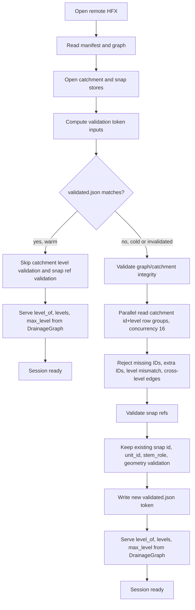

# R2 Open Reuse Step Plan

Date: 2026-06-06
Owner: shed reader/session
Scope: surgical `shed-core` reader/session changes only.

## Executive Summary

Choose **A: preserve detection via cold-validate / warm-skip**. Query-time levels should come from the already-loaded `DrainageGraph`, but the first cold open must still read catchment `(id, level)` once to prove catchment-vs-graph equality and reject the exact M2 corruption cases that exist today. A valid sidecar then lets warm opens skip that catchment-side validation read; any token-invalidating dataset or validation-logic change re-runs it. This preserves the hard constraint that the bad datasets rejected by `graph_row_level_must_match_catchment_level` and `test_graph_level_mismatch_from_open_path` remain rejected, while removing the current warm-path scan.

Decisive evidence:

- The current remote warm fast path is disabled for GRIT because `validation_hit` requires `snap_stores.len() <= 1` at `crates/core/src/session.rs:446`; GRIT v2.0.0 has two snap declarations in cached `manifest.json`.
- Even when `validation_hit` is true, the current code still materializes every catchment level through `catchments.read_id_levels()` at `crates/core/src/session.rs:455-467`.
- The cold validation path calls the same scan at `crates/core/src/session.rs:967`; the implementation is serial over all row groups at `crates/core/src/reader/catchment_store.rs:760-803`.
- GRIT's cached id index represents 22,337,300 IDs across 5,453 row groups. A serial RTT lower bound is about 164 s at 30 ms RTT or 327 s at 60 ms RTT; concurrency 16 reduces the RTT batches to about 341, or about 10-21 s before bytes/decode.
- The id index cannot supply levels: `IdIndex` stores `ids` and optional `row_group` only at `crates/core/src/reader/id_index.rs:24-28`, with schema fields `id` and `row_group` at `crates/core/src/reader/id_index.rs:112-115`.
- The graph reader already parses graph levels into `AdjacencyRow::new(id, level, upstream_ids)` at `crates/core/src/reader/graph.rs:169-178`, so query-time `level_of` and `max_level` can be graph-derived without changing HFX.
- Option B would delete the only check that catches catchment-level corruption. That violates the dispatch hard constraint because the rejection tests at `crates/core/tests/graph_parquet_reader.rs:150` and `crates/core/tests/session_open.rs:907` would open silently unless removed.
- A valid warm token must attest every artifact participating in the validated relationship: manifest, graph, catchments, and all snaps. Remote graph/manifest cache reuse is independent from `validated.json` at `crates/core/src/session.rs:345-354`, so a token that omits graph metadata can silently accept a graph-only swap while catchments/snaps are unchanged.

End-state contract: cold first open validates full referential integrity, including catchment-vs-graph level equality and current snap geometry/`stem_role` rejection behavior, with parallelized catchment `(id, level)` reads. Warm open with a valid token reads/parses the cached or fetched manifest and graph, verifies the token against manifest+graph+catchments+all snaps, serves levels from the graph, and performs no catchment level scan or snap validation scan. Referential-integrity detection is not weakened on first open or after any sidecar-invalidating change.

Current version discipline verified on 2026-06-06: `Cargo.toml` reports `version = "0.1.168"`. `git tag | tail` is lexical and misleading (`v0.1.90` through `v0.1.99`), while `git tag --sort=v:refname | tail` shows `v0.1.159` through `v0.1.168`. Each implementation step below requires one patch bump, one commit, and one `v<version>` tag. `pyshed` is untouched.

## Post-Fix Open Path

## Validity Token

Use a validation sidecar token that is about validation inputs and validation logic, not the crate patch version.

Fields:

- `token_format_version`: integer, initially `2`, for the JSON schema itself.
- `validation_logic_version`: integer or short string constant, initially `r2-open-reuse-v1`, bumped only when open-time referential validation semantics change.
- `hfx_format_version`: from `manifest.format_version`, currently `0.2.1`.
- `manifest`: artifact path plus ETag plus size.
- `graph`: artifact path plus ETag plus size.
- `catchments`: artifact path plus ETag plus size.
- `snaps`: sorted array of every snap declaration's artifact path plus ETag plus size. This replaces the current single optional `snap_etag`/`snap_size` shape at `crates/core/src/cache.rs:34-40`.
- `validated_at`: existing timestamp.

Where computed:

- Extend `ValidationSidecar` in `crates/core/src/cache.rs:33` and its constructor/matcher at `crates/core/src/cache.rs:237-255`.
- Replace `validation_sidecar_matches` and `validation_sidecar_for_current_metadata` at `crates/core/src/session.rs:1156-1176` so they receive the manifest format version plus all declared snap artifact metadata, not `snap_stores.first()` from `crates/core/src/session.rs:443-445`.
- Add graph and manifest artifact metadata plumbing in the remote open path. Today manifest and graph are fetched/parsed at `crates/core/src/session.rs:355-401` or read from cache at `crates/core/src/session.rs:345-354`; the implementation must capture ETag+size for both artifacts and make those values available before token matching. Use HEAD/stat-style object metadata requests for these token fields, not extra full GETs. If it cannot obtain manifest or graph ETags, the token must not match.

Match rule:

- All token fields above match exactly.
- Snap artifacts are compared after deterministic sorting by declared artifact path, so manifest order changes do not invalidate when the set is identical.
- Missing ETag for manifest, graph, catchments, or any declared snap means no warm-skip token is trusted; validate and either write no token or write only if a content token is available. Do not silently trust size alone.

Invalidation:

- Manifest ETag or size changes.
- Graph ETag or size changes.
- Catchments ETag or size changes.
- Any snap artifact path, ETag, or size changes.
- HFX `format_version` changes.
- `token_format_version` changes.
- `validation_logic_version` changes.

Proof obligation:

- A changed or forged dataset must revalidate because remote artifact mutation changes at least ETag or size for manifest, graph, catchments, or snaps. The critical graph-only swap case is covered: if cached `graph.parquet` is evicted while `validated.json` survives and the remote graph changes, the new graph ETag/size cannot match the token, so `validate_graph_catchments` re-runs. If a backend cannot provide ETags, the implementation must not consider the sidecar valid from size alone. If a future backend can produce content hashes, that content token can be added under a new token format version.
- Routine patch bumps must not invalidate every cache. The trade-off is that implementers must deliberately bump `validation_logic_version` when validation semantics change. A test can pin matching behavior and prove an explicit version change invalidates tokens, but no test can detect a future validator edit that forgot to bump the constant. Put a doc comment beside the constant and beside `validate_graph_catchments` / `validate_snap_refs`: changing open-time referential validation requires bumping `validation_logic_version`. This is preferable to tying cache validity to `CARGO_PKG_VERSION`, which currently makes the cached GRIT `validated.json` with `"shed_version":"0.1.0"` fail forever against `0.1.168`.

## Steps

### 1. Prove and remove the warm catchment level scan

Goal: Make a valid-token warm remote open skip `read_id_levels()` while preserving graph-derived query levels.

Scope note: this step by itself speeds up only datasets that can already reach the sidecar-HIT branch, which currently means zero- or one-snap remote datasets. GRIT v2.0.0 remains slow until Step 2 removes the `snap_stores.len() <= 1` gate and replaces the token shape.

Regression-proof-first:

- Add a test-only counter beside the existing geometry decode counter in `crates/core/src/reader/catchment_store.rs:51` and `crates/core/src/reader/catchment_store.rs:1286-1299`.
- Instrument the real path by incrementing it inside `CatchmentStore::read_id_levels` or `read_id_levels_async` at `crates/core/src/reader/catchment_store.rs:732-736`.
- Add `read_id_level_scan_count_for_test` and `reset_read_id_level_scan_count_for_test`, protected by the same `GEOMETRY_DECODE_TEST_LOCK` pattern. Every test touching the counter must acquire `GEOMETRY_DECODE_TEST_LOCK.lock().unwrap_or_else(|e| e.into_inner())` as its first line, mirroring `crates/core/src/session.rs:2114-2117`.
- Add or extend a remote warm-cache test in `crates/core/src/session.rs` near `second_remote_open_uses_persistent_indexes_and_validation_sidecar` at `crates/core/src/session.rs:2114`. The test opens once to create the sidecar, resets the counter, opens again, and asserts the old code enters the real level scan (`count > 0`). After the fix the same assertion becomes `count == 0`.

Change:

- Remove the `catchment_levels: HashMap<UnitId, Level>` field from `DatasetSession` at `crates/core/src/session.rs:97` only if the local open path can keep M2 checks without storing it. Otherwise stop populating it on warm remote opens and make it derived lazily from graph for all query methods.
- Change `level_of`, `levels`, and `max_level` at `crates/core/src/session.rs:570-588` to read from `self.graph`, whose levels are parsed at `crates/core/src/reader/graph.rs:169-178`.
- Keep `resolver.rs:372-374` and `engine.rs:602-605` behavior unchanged; their contract becomes graph-derived levels.
- Use `tracing::debug!`/`info!` for skip/validation decisions. No `println!`, no `log`.
- Do not introduce bool mode flags. If a validation-state value is needed, use an enum such as `ValidationReuse::{ValidToken, MustValidate}`.

Per-step gates:

- New warm-scan regression test fails before the fix and passes after.
- Existing `second_remote_open_uses_persistent_indexes_and_validation_sidecar` remains green.
- Run the touched test suite loop under the default parallel test runner about 5 times, for example `for i in 1 2 3 4 5; do cargo test -p shed-core session::tests::second_remote_open_uses_persistent_indexes_and_validation_sidecar; done`.

Version step:

- `./scripts/bump-version.sh patch`
- Stage code plus `Cargo.toml` and `Cargo.lock`.
- Commit: `perf(core): skip warm catchment level scan`
- Tag: `git tag v$(grep '^version' Cargo.toml | head -1 | sed 's/.*"\\(.*\\)"/\\1/')`

### 2. Replace crate-version sidecar matching with a manifest/graph/catchments/snaps token

Goal: Make warm-skip depend on dataset identity and validation-logic version, including manifest, graph, catchments, and every snap artifact, not snap arity or crate patch version.

Regression-proof-first:

- Add cache-side unit tests in `crates/core/src/cache.rs` near `validation_sidecar_matches_exact_metadata_and_version` at `crates/core/src/cache.rs:329`.
- Tests must prove current failure modes on the real matcher: a legacy sidecar with only `shed_version` fails closed because it lacks manifest/graph attestation; a v2 sidecar is not tied to `CARGO_PKG_VERSION`; changing `validation_logic_version` should fail after the change; changing manifest, graph, catchments, or one snap's ETag/size should fail; two snap artifacts should match regardless of order.
- Add a session test with two declared snap stores in `crates/core/src/session.rs` near `put_remote_manifest_and_graph` at `crates/core/src/session.rs:1820`, proving the old `snap_stores.len() <= 1` gate forces validation on the second open. Use the read-id-level counter from Step 1 as the real-path proof, and add a snap validation scan counter proving the old two-snap second open enters `validate_snap_refs` through `crates/core/src/session.rs:479-481` while the fixed valid-token second open performs `0` snap validation scans.
- Add the two-snap fixture infrastructure explicitly: a manifest helper that emits two `hfx.aux.snap.v1` declarations with distinct artifact paths, two snap parquet artifacts inserted into the `InMemory` store, and token assertions that both snap artifact metadata entries are present.

Change:

- Replace `ValidationSidecar.shed_version` at `crates/core/src/cache.rs:40` with the token fields listed above. Keep backwards compatibility by deserializing old sidecars as non-matching, not as errors.
- Update `ValidationSidecar::current` and `matches` at `crates/core/src/cache.rs:237-255`.
- Change remote sidecar computation at `crates/core/src/session.rs:442-453` and `crates/core/src/session.rs:483-490` to include manifest, graph, catchments, and all snap metadata, not just `.first()`.
- Extend remote manifest/graph fetch/cache plumbing so `validated.json` matching can attest the graph loaded at `crates/core/src/session.rs:345-354` or fetched at `crates/core/src/session.rs:355-401`. Collect new manifest/graph ETag+size metadata with HEAD/stat-style object metadata requests, not extra full GETs, so warm open does not pay another manifest/graph download just to validate the token.
- Remove the `snap_stores.len() <= 1` fast-path gate at `crates/core/src/session.rs:446`; validity is token-driven.
- Prefer named-field structs/newtypes for token pieces if they cross function boundaries, e.g. `ValidationLogicVersion` or `SidecarFormatVersion`.

Per-step gates:

- New cache token tests pass.
- New two-snap warm-skip test fails before the fix and passes after, covering both the read-id-level counter and the snap validation scan counter.
- New graph metadata mismatch cache test fails before the fix and passes after.
- Existing cache tests at `crates/core/src/cache.rs:329` and `crates/core/src/cache.rs:352` are updated and green.

Version step:

- `./scripts/bump-version.sh patch`
- Stage code plus `Cargo.toml` and `Cargo.lock`.
- Commit: `fix(core): validate remote sidecars by artifact token`
- Tag: `git tag v$(grep '^version' Cargo.toml | head -1 | sed 's/.*"\\(.*\\)"/\\1/')`

### 3. Preserve M2 catchment-vs-graph level detection on cold and invalidated opens

Goal: Keep the M2 bad datasets rejected while moving query-time levels to the graph.

Regression-proof-first:

- Keep the existing rejection tests unchanged:
  - `crates/core/tests/graph_parquet_reader.rs:150`, `graph_row_level_must_match_catchment_level`
  - `crates/core/tests/session_open.rs:907`, `test_graph_level_mismatch_from_open_path`
- Add a remote catchments-invalidation test in `crates/core/src/session.rs`: open once to write a valid token, mutate `catchments.parquet` in the in-memory store so one catchment level disagrees with the graph and the artifact ETag/size token changes, then open again and assert `SessionError::GraphReferentialIntegrity` with `"differs from catchment level"`. This proves warm-skip is bypassed on a catchments token change.
- Add a remote graph-invalidation test in `crates/core/src/session.rs`: open once to write a valid token, simulate cached graph eviction while leaving `validated.json` intact, mutate only `graph.parquet` so it disagrees with unchanged catchments and changes graph ETag/size, then open again and assert the real `validate_graph_catchments` path rejects it. This is the prime proof that graph-derived warm levels are soundly token-attested.
- Use the real `validate_graph_catchments` path at `crates/core/src/session.rs:952`, not a mocked validator.

Change:

- Keep `validate_graph_catchments` returning enough validation output for snap validation on cold opens, but do not use that output as the session's query-time level source.
- Preserve the equality check at `crates/core/src/session.rs:1002-1010` and the same-level upstream check at `crates/core/src/session.rs:1022-1037`.
- Use graph-derived levels for snap validation only after the cold catchment-vs-graph equality has passed, or use the cold catchment-level map internally during validation and discard it before constructing `DatasetSession`.
- Keep errors as `thiserror` named-field variants where new variants are needed. Do not add `unwrap()`/`expect()` in library code.

Per-step gates:

- `cargo test -p shed-core --test graph_parquet_reader graph_row_level_must_match_catchment_level`
- `cargo test -p shed-core --test session_open test_graph_level_mismatch_from_open_path`
- New remote catchments-invalidation rejection test passes.
- New remote graph-invalidation rejection test passes.

Version step:

- `./scripts/bump-version.sh patch`
- Stage code plus `Cargo.toml` and `Cargo.lock`.
- Commit: `fix(core): preserve cold level mismatch detection`
- Tag: `git tag v$(grep '^version' Cargo.toml | head -1 | sed 's/.*"\\(.*\\)"/\\1/')`

### 4. Parallelize the surviving cold catchment id+level scan

Goal: Make the mandatory cold detection pass complete in tens of seconds instead of minutes on high-RTT R2.

Regression-proof-first:

- Add a performance-shape test in `crates/core/src/reader/catchment_store.rs` near `test_read_id_levels_returns_expected_pairs` at `crates/core/src/reader/catchment_store.rs:2120`.
- The test should hit `read_id_levels_async` with a multi-row-group in-memory or counting object store and prove overlapping row-group reads occur on the real path. Instrument row-group entry/exit with a test-only max-in-flight counter, protected by `GEOMETRY_DECODE_TEST_LOCK` acquired as the first test line.
- The old serial code should report max in-flight `1`; the fixed code should report `> 1` while preserving exact `(id, level)` output.

Change:

- Refactor `read_id_levels_async` at `crates/core/src/reader/catchment_store.rs:736-806` to mirror `read_all_ids_with_row_groups_async` at `crates/core/src/reader/catchment_store.rs:1359-1379`.
- Reuse `ID_INDEX_ROW_GROUP_CONCURRENCY = 16` from `crates/core/src/reader/catchment_store.rs:43`.
- Do not construct a fresh footer/metadata builder inside a serial loop. Keep the existing `ArrowReaderMetadata` and `ProjectionMask` sharing pattern.
- Add structured tracing around `num_row_groups`, `concurrency`, and elapsed time.

Per-step gates:

- New parallelism-shape test fails before the fix and passes after.
- `cargo test -p shed-core reader::catchment_store::tests::test_read_id_levels_returns_expected_pairs`
- Loop relevant tests about 5 times under the default runner to prove the global counters do not flake.

Version step:

- `./scripts/bump-version.sh patch`
- Stage code plus `Cargo.toml` and `Cargo.lock`.
- Commit: `perf(core): parallelize cold catchment level validation`
- Tag: `git tag v$(grep '^version' Cargo.toml | head -1 | sed 's/.*"\\(.*\\)"/\\1/')`

### 5. Guard and measure snap validation without weakening detection

Goal: Keep current snap geometry and `stem_role` detection on cold/invalidated opens, and measure the remaining cold snap validation cost.

Regression-proof-first:

- Keep the existing rejection tests as non-negotiable regression proofs:
  - `crates/core/tests/snap_aux_reader.rs:248`, `snap_aux_invalid_stem_role_is_typed`
  - `crates/core/tests/snap_aux_reader.rs:332`, `snap_aux_rejects_non_point_or_linestring_wkb`
- Keep the snap validation scan counter introduced in Step 2 available for measurement and non-flake coverage, guarded by the same shared-lock discipline if it uses global mutable state.
- Do not claim a new warm-skip proof here: the snap warm-skip behavior is delivered and regression-tested in Step 2 when the `snap_stores.len() <= 1` gate is removed. This step is for cold detection guards and instrumentation.
- Add cold measurement instrumentation or structured tracing around `read_all_snap_refs_from_store_async`, preserving its real geometry decode and `stem_role` parse path at `crates/core/src/reader/snap_store.rs:780-832`.

Change:

- Do not drop the `geometry` projection or `stem_role` parsing on cold/invalidated opens. Current open-time validation rejects null/invalid geometry and non-Point/non-LineString WKB at `crates/core/src/reader/snap_store.rs:799-832`, and invalid `stem_role` at `crates/core/src/reader/snap_store.rs:820-829`.
- The performance win for snap validation in this milestone is warm-skip behind the manifest+graph+catchments+snaps token, not deleting cold detection.
- Preserve the existing parallel `.buffered(ID_INDEX_ROW_GROUP_CONCURRENCY)` at `crates/core/src/reader/snap_store.rs:687-696`.
- If future work wants to move snap geometry validity entirely to the HFX validator and stop open-time geometry validation, that is an **ESCALATE-to-human** decision requiring a spec citation from `../hfx/spec/HFX_SPEC.md` and explicit test updates/removals. It is not part of this dispatch plan.

Per-step gates:

- `cargo test -p shed-core --test snap_aux_reader`
- `cargo test -p shed-core session::tests::second_remote_open_uses_persistent_indexes_and_validation_sidecar`
- Loop the snap validation counter tests about 5 times under the default runner if Step 5 touches or extends that counter.

Version step:

- `./scripts/bump-version.sh patch`
- Stage code plus `Cargo.toml` and `Cargo.lock`.
- Commit: `test(core): guard snap validation reuse`
- Tag: `git tag v$(grep '^version' Cargo.toml | head -1 | sed 's/.*"\\(.*\\)"/\\1/')`

### 6. Measure and close the milestone

Goal: Prove the performance and soundness contract on real and proxy datasets.

Regression-proof-first:

- Add ignored/manual performance tests or a documented command path that opens the remote GRIT v2.0.0 URL with `timeout <N>s` and records cold/warm timings without clearing the user's cache.
- Add a local large-dataset warm-open smoke for `/Users/nicolaslazaro/Desktop/merit-hfx-v2/planetary/merit-hfx-global` if it can run without network and without altering user cache state.
- These are gates, not production behavior changes.

Change:

- No functional change unless measurement uncovers a missed scan. If a missed scan appears, add a new regression-proof-first step before fixing it.
- Update docs only if needed to record the exact manual perf commands and measured results.

Per-step gates:

- GRIT warm open with cache present is single-digit seconds.
- GRIT cold first open, or forced token-invalidated open without deleting cache, completes within the stated cold target below.
- Local MERIT global warm open meets the local target below.
- Report the cached graph parse floor separately from validation I/O. After the level scan is removed, GRIT warm open still parses a cached graph of about 700 MB and 22.3M rows on every open; if that parse alone approaches 9 s, record it as the limiting floor rather than hiding it in metadata time.
- Report the cold snap validation contribution separately. GRIT has about 20.5M `snap_reaches` refs plus `snap_segments`; Step 5 keeps geometry and `stem_role` validation, so the cold `< 60 s` gate must be backed by measured snap validation time, not just catchment RTT math.

Version step:

- If code or committed docs change: patch bump, stage `Cargo.toml`/`Cargo.lock`, commit `test(core): measure r2 open reuse`, tag.
- If this step is purely manual measurement after prior commits, no commit is required.

## Milestone Gates

PERF:

- Remote GRIT v2.0.0 warm open with cache present: **single-digit seconds**, target `< 9 s` measured, with the cached graph parse floor reported separately. If graph parse alone is near or above the target, the milestone must record that fact and avoid adding out-of-scope graph-load work without a new plan.
- Remote GRIT v2.0.0 cold or token-invalidated validation: target **< 60 s at 30-60 ms RTT**, assuming 5,453 row groups, concurrency 16, and cached manifest/graph/idindex behavior comparable to the investigation. RTT math is about 10-21 s lower bound for the catchment level pass; the remaining budget must be verified against measured parquet decode and the two cold snap validation scans that still validate geometry and `stem_role`.
- Local proxy `merit-hfx-global` at `/Users/nicolaslazaro/Desktop/merit-hfx-v2/planetary/merit-hfx-global`: warm open target **< 3 s** after local cache/token is present. Structural evidence: 2,876,771 rows, 702 catchment row groups, 6.6 GB catchments, 84 MB graph.

SIDECAR/TOKEN SOUNDNESS:

- Test proves validation is skipped on a valid token by asserting `read_id_levels` counter is `0` on warm open.
- Test proves validation re-runs when catchments ETag/size changes and still rejects a catchment-vs-graph level mismatch.
- Test proves validation re-runs when graph ETag/size changes, even with unchanged catchments/snaps, and still rejects graph/catchment violations.
- Test proves manifest ETag/size changes invalidate the token.
- Test proves any snap ETag/size/path change invalidates the token.
- Test proves validation-logic version change invalidates the token, while routine crate patch version changes do not.

REFERENTIAL DETECTION:

- All existing rejection tests remain green for option A:
  - `cargo test -p shed-core --test hfx_v02_loader`
  - `cargo test -p shed-core --test session_open`
  - `cargo test -p shed-core --test graph_parquet_reader`
  - `cargo test -p shed-core --test snap_aux_reader`
- Specifically do not remove or weaken `graph_row_level_must_match_catchment_level` at `crates/core/tests/graph_parquet_reader.rs:150` or `test_graph_level_mismatch_from_open_path` at `crates/core/tests/session_open.rs:907`.

DURABILITY:

- `cargo test -p shed-core --test parity_golden_artifacts`
- `cargo test -p shed-core --test staged_delineation`
- `cargo test -p shed-core --test d8_refinement_parity`
- `cargo test -p shed-core --test export`
- `cargo build --workspace --exclude pyshed`
- `cargo check -p pyshed`
- `cargo clippy --workspace -- -D warnings`

Pyshed note: `pyshed` is a PyO3 `cdylib` that does not plain-link in `cargo build --workspace` on macOS. Use `cargo build --workspace --exclude pyshed` plus `cargo check -p pyshed`; this is expected, not a bug. Do not bump or republish `pyshed` in this milestone.

## Non-Scope

- No HFX format or writer change.
- No eager/in-memory delineation mode.
- No D8 or `AmbiguousD8Coverage` work (`clog #63`).
- No `pyshed` version bump or republish.
- No new features.
- No deletion or weakening of open-time snap geometry or `stem_role` detection.
- Hot delineation path, M1 canonicalizer/goldens, M3 stages, M4 carve, and M5 export stay untouched except as necessary for compile/test fallout from graph-derived level access.

## Risks / Open Questions

- **No ESCALATE for reconciliation**: option A satisfies the hard constraint. Option B remains rejected because it would silently accept wrong catchment levels and would require a human waiver plus test removal.
- **ESCALATE if backend metadata lacks ETags for target deployments**: this plan requires ETag+size or a stronger content token to warm-skip safely. Size-only matching is not sound enough for forged or changed datasets.
- **ESCALATE if someone wants to drop snap geometry validation**: current tests require `DatasetSession::open_path` to reject invalid snap WKB and invalid `stem_role`. Moving that detection to HFX validation is a separate human decision requiring a spec citation and explicit test changes.
- **Validation logic version discipline**: routine patch bumps no longer invalidate tokens. The human/team must treat `validation_logic_version` as a real compatibility knob and bump it whenever referential validation semantics change.
- **Manual perf variance**: the cold `< 60 s` target assumes 30-60 ms RTT and no severe R2 throttling. If observed cold timing exceeds target after scans are parallel and warm skip is sound, capture catchment level scan time, snap validation scan time, graph parse time, and range-read counts before widening scope.
