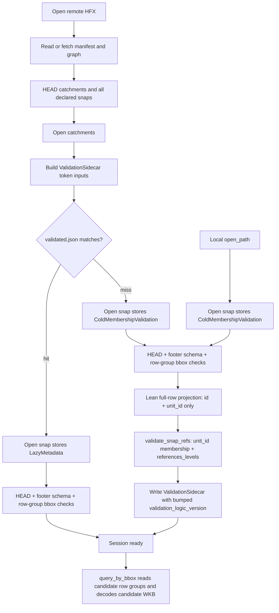

# R2 Snap Open Reuse Step Plan

Date: 2026-06-06
Owner: shed reader/session
Scope: surgical `shed-core` reader/session/snap-store changes only. HFX format, GRIT adapter, hot delineation logic, M1 goldens, M3/M4/M5, D8 work, and `pyshed` versioning are out of scope.

## Executive Summary

Choose **trust-HFX snap geometry/role validity plus shed-only referential membership validation**.

The locked decision is that shed must trust the HFX reference validator for snap WKB well-formedness and `stem_role` values at publish time. Shed's non-duplicable open-time job is validating the specific artifacts it loaded against each other: every snap `unit_id` must exist in the loaded catchment/graph ID set, and each referenced unit level must be declared in that snap auxiliary entry's `references_levels`.

Evidence for the trust boundary:

- `../hfx/crates/hfx-validator/src/check/auxiliary.rs:151-161` reads each `hfx.aux.snap.v1` snap artifact, then runs `check_snap_stem_roles` and `geometry::check_snap_geometries`.
- `../hfx/crates/hfx-validator/src/check/auxiliary.rs:207-222` enforces `stem_role` values: `mainstem`, `tributary`, `distributary`, or `unknown`.
- `../hfx/crates/hfx-validator/src/check/geometry.rs:50-70` validates all snap geometries as WKB Point/LineString; `geometry.rs:149-164` rejects non-Point/LineString snap geometry type codes.
- `../hfx/crates/hfx-validator/src/reader/snap.rs:295-333` reports null snap geometry while reading the snap artifact.
- `../hfx/spec/HFX_SPEC.md:367-390` lists the `stem_role` enum, snap referential integrity, and WKB Point/LineString snap geometry requirements; `HFX_SPEC.md:392-396` lists WKB geometry and snap checks under reference validator coverage.

Evidence for the current shed cost and the surgical target:

- `DatasetSession::open_remote_with_stats` currently opens every snap before token matching: `crates/core/src/session.rs:452-473`, then builds token inputs at `session.rs:475-493`.
- `SnapStore::open_object` validates snap schema and row-group bbox metadata at `crates/core/src/reader/snap_store.rs:325-360`, then immediately calls `read_or_build_id_index` at `snap_store.rs:363-373`.
- `read_or_build_id_index` always enters `read_all_snap_refs_from_store` at `snap_store.rs:610-620`.
- The current cold scan projects `id`, `unit_id`, `geometry`, and optional `stem_role` at `snap_store.rs:673-697`; it parses `stem_role`, decodes WKB, enforces Point/LineString, increments `geometry_rows_validated`, and pushes `SnapUnitRef` at `snap_store.rs:854-869`.
- `validate_snap_refs` consumes only `SnapUnitRef { snap_id, unit_id }` at `crates/core/src/session.rs:1103-1141`, and checks only membership plus `references_levels`.

Revised end-state contract:

- Cold, token-miss, and local opens validate snap membership only with a lean `[id, unit_id]` projection over every snap row, parallelized with `.buffered(16)`. They do not project or decode snap `geometry`, do not enforce Point/LineString, and do not parse `stem_role`.
- Warm token-hit remote opens decide token reuse before full snap opening. On hit, they open snap stores lazily: HEAD/footer/schema/row-group bbox only, and zero snap ref reads.
- Both cold and warm opens still reject malformed snap schema and malformed bbox columns at open because `SnapStore::open_object` keeps footer/schema checks.
- `query_by_bbox` is unchanged. It still reads the small windowed candidate row groups and decodes candidate WKB during delineation; a contract-violating malformed snap geometry now surfaces there, with existing `SessionError::SnapGeometryInvalid`, rather than through a full open-time geometry scan.

`VALIDATION_LOGIC_VERSION` **must bump**. Current `crates/core/src/cache.rs:61-62` says to bump when open-time referential validation semantics change, and this change also changes shed's open-time accept/reject set: datasets with invalid snap geometry or invalid `stem_role` can now open if their membership is valid. Bump from `r2-open-reuse-v1` to a new explicit value such as `r2-snap-membership-v2` in the wiring step. Consequence: existing `validated.json` tokens fail closed once and are rewritten only after the new membership-only validation succeeds. Explicit invalidation discipline: bump before writing any token under the new rules; never let a token produced by the old geometry/role scan silently attest the new membership-only contract.

Current version discipline verified on 2026-06-06: `Cargo.toml` reports `version = "0.1.173"`. Every implementation step below requires one patch bump, one conventional commit, and one matching `v<version>` tag. Do not bump or republish `pyshed`.

## Post-Fix Open Path

Open-time checks that stay on both warm and cold paths:

- HEAD metadata for every snap artifact so token matching includes path, ETag, and size.
- Parquet footer/schema parsing via `ParquetRecordBatchStreamBuilder` in `SnapStore::open_object`.
- Required columns: `id`, `unit_id`, `weight`, `geometry`; optional `stem_role` must be Utf8 when present; optional bbox columns must either all be present and Float32 or all absent.
- Row-group bbox metadata extraction into `row_groups` / `groups_without_stats`, so `query_by_bbox` remains correct and malformed bbox schema still fails at open.

Cold-membership-only work:

- Read all snap rows with a lean `[id, unit_id]` projection.
- Parse `SnapId` and `UnitId`, reject null/invalid IDs, and collect `SnapUnitRef`.
- Run `validate_snap_refs` to enforce `unit_id` membership in the loaded catchment/graph ID set and the snap declaration's `references_levels`.

Open-time checks intentionally moved out of shed:

- Full snap WKB decode.
- Point/LineString enforcement.
- Non-null `stem_role` value parsing.

## Steps

### 1. Prove the current warm and cold snap scans decode geometry

Goal: Add the regression proof for both sides of the bug before changing behavior: a valid-token second remote open currently performs snap geometry validation, and a cold/miss open currently decodes geometry instead of using a lean membership pass.

Regression-proof-first:

- Add a test-only geometry decode counter at the durable shared decode site that survives this milestone: `geometry_from_array` at `crates/core/src/reader/snap_store.rs:1138` or `validate_snap_geometry` at `snap_store.rs:1162`. Do **not** anchor the counter in `read_snap_refs_row_group_async` or `read_all_snap_refs_from_store_async`; Step 3 deletes that open-time full-scan reader chain.
- Name it consistently as `SNAP_GEOMETRY_DECODE_ROWS_FOR_TEST`, exposed through `snap_geometry_decode_rows_for_test()`. The current open-time full scan reaches the same durable decode helper, so the fail-before proof still records `> 0`; after the fix, open records `0`, while `query_by_bbox` can still make the counter non-zero. This keeps the guard non-vacuous.
- Add a separate membership counter for the future lean reader: `SNAP_MEMBERSHIP_ROWS_FOR_TEST`, exposed through `snap_membership_rows_for_test()`. In this step it can remain zero or be introduced with the old path still counting refs; Step 2 makes it authoritative.
- Expose test-only reset/get helpers and guard tests with `GEOMETRY_DECODE_TEST_LOCK` as the first line, matching `crates/core/src/session.rs:2277-2280` and `session.rs:2357-2360`.
- Extend the two-snap token test near `crates/core/src/session.rs:2357`: open once to create the token, reset counters, open again, and assert the current code records geometry rows `> 0` on the second open. After Step 3, flip this expectation to `0`.
- Add a cold/miss control using `DatasetSession::open_remote` or `DatasetSession::open_path`: reset counters, open without a valid token, and assert current geometry rows `> 0`.

Change:

- Test-only instrumentation in `crates/core/src/reader/snap_store.rs` and assertions in `crates/core/src/session.rs`.
- Keep the geometry counter increment function live by placing it only in the shared decode helper used by both old open-time validation and surviving query-time decode. Do not leave test-only counter plumbing that is called only from the soon-to-be-deleted full-scan reader.
- No production behavior change in this step.

Gates:

- New fail-before tests demonstrate `snap_geometry_decode_rows_for_test() > 0` on current `v0.1.173`.
- Existing `second_remote_open_with_two_snaps_uses_validation_sidecar` still passes.
- Loop the new counter tests 5x under the default runner to catch global-counter flakes.

Version step:

- `./scripts/bump-version.sh patch`
- Stage code plus `Cargo.toml` and `Cargo.lock`.
- Commit: `test(core): prove snap opens scan geometry`
- Tag: `git tag v$(grep '^version' Cargo.toml | head -1 | sed 's/.*"\\(.*\\)"/\\1/')`

### 2. Add lean snap membership validation and lazy snap open

Goal: Make `SnapStore` capable of two explicit open modes: lazy metadata for token hits and cold membership validation for local/token-miss opens. Existing call sites can remain behavior-preserving until Step 3, but the new lean reader must be tested directly.

Regression-proof-first:

- Add a direct snap-store test near `test_query_by_bbox_returns_matching` at `crates/core/src/reader/snap_store.rs:1683`. It should open a fixture through the new cold membership mode and assert `snap_membership_rows_for_test() > 0` and `snap_geometry_decode_rows_for_test() == 0`.
- Add a direct bad-membership fixture proof through the real session validator: invalid `unit_id` still reaches `SessionError::SnapReferentialIntegrity`, using the path currently covered by `crates/core/tests/snap_aux_reader.rs:275-300`.
- Add lazy-open schema rejection tests: wrong `stem_role` type, missing `geometry`, and partial bbox columns must still fail at open. These prove lazy mode keeps `snap_store.rs:325-338` and `snap_store.rs:1051-1094`.
- Add a lazy-open `query_by_bbox` smoke proving bbox candidates still read and return snap targets through `snap_store.rs:411-494` and `snap_store.rs:878-1049`.

Change:

- Introduce an explicit enum, for example `SnapOpenMode::{LazyMetadata, ColdMembershipValidation}`. Do not use a boolean flag.
- Add a lean reader, for example `read_all_snap_membership_refs_from_store_async`, that projects only `id` and `unit_id`, selects all row groups, uses the existing `ID_INDEX_ROW_GROUP_CONCURRENCY` `.buffered(16)` pattern at `snap_store.rs:715-724`, and returns `Vec<SnapUnitRef>`.
- Keep null/invalid `id` and `unit_id` rejection from `snap_store.rs:819-853`, but remove geometry null checks, WKB decode, Point/LineString enforcement, and `stem_role` parsing from the open-time membership reader.
- Add structured `tracing` stats for the lean pass: refs, row groups, batches, membership rows, concurrency, elapsed milliseconds, and projected columns. Use `tracing`, not `println!` or `log`.
- Add a state that makes eager absence explicit, for example `SnapRefsState::{NotLoaded, Loaded(Vec<SnapUnitRef>)}`, replacing `all_snap_refs: Vec<SnapUnitRef>` at `snap_store.rs:159`.
- Make `read_all_snap_refs()` and `read_all_unit_ids()` return a typed `SessionError` when called on `SnapRefsState::NotLoaded`; never `unwrap`, `expect`, or panic in library code. The production invariant is that `validate_snap_refs` only calls these accessors on `ColdMembershipValidation` stores, but the accessor must defend the lazy-store case explicitly.
- In `LazyMetadata`, keep HEAD, cache identity, footer/schema validation, row-group bbox extraction, `file_size`, `file_etag`, `row_groups`, `groups_without_stats`, caches, and `cache_ident`; skip all snap ref reads.
- In `ColdMembershipValidation`, populate `SnapRefsState::Loaded` from the lean reader.
- Keep Step 2 clippy-clean even if production wiring lands in Step 3. Either wire the modes in this step, or add a narrowly scoped temporary `#[cfg_attr(not(test), allow(dead_code))]` on unused mode/state and remove it in Step 3. Do not leave a broad module-level allow.
- Update or remove `test_read_all_unit_ids_uses_cached_index` around `snap_store.rs:1617-1681`; it depends on eager post-open refs and is currently only a snap-store self-test consumer.
- Keep `artifact_meta()` at `snap_store.rs:529-535` working from HEAD metadata.

Gates:

- New cold membership test fails before the lean reader and passes with `snap_membership_rows_for_test() > 0` and `snap_geometry_decode_rows_for_test() == 0`.
- Schema rejection tests fail at open, not only at query time.
- `query_by_bbox` still passes after lazy open.
- Existing referential tests stay green:
  - `cargo test -p shed-core --test snap_aux_reader snap_aux_missing_unit_id_reports_real_snap_id`
  - `cargo test -p shed-core --test snap_aux_reader snap_aux_references_levels_mismatch_reports_real_snap_id`
- Step 2 is clippy-clean: `cargo clippy -p shed-core -- -D warnings`.

Version step:

- `./scripts/bump-version.sh patch`
- Stage code plus `Cargo.toml` and `Cargo.lock`.
- Commit: `perf(core): add lean snap membership open`
- Tag: `git tag v$(grep '^version' Cargo.toml | head -1 | sed 's/.*"\\(.*\\)"/\\1/')`

### 3. Decide validation reuse before opening snap stores

Goal: Reorder remote session open so token matching happens before any snap membership read. On hit, open snaps lazily and skip snap ref reads. On miss, open snaps with cold membership validation and run `validate_snap_refs`.

Regression-proof-first:

- Flip the Step 1 warm-token test: after this step a valid-token second open must assert `snap_validation_scan_count_for_test() == 0`, `snap_membership_rows_for_test() == 0`, and `snap_geometry_decode_rows_for_test() == 0`.
- Add a token-miss control: mutate one snap artifact after the first open so its ETag/size changes, then open again and assert `snap_membership_rows_for_test() > 0` and `snap_geometry_decode_rows_for_test() == 0`.
- Add a token-miss bad-membership control: mutate a snap `unit_id` to a missing catchment and assert `SessionError::SnapReferentialIntegrity`. This must use the real `validate_snap_refs` path at `session.rs:1107-1141`.
- Add a missing-ETag/fail-closed test if object-store fixtures can simulate missing ETag; otherwise keep backend-no-ETag as an ESCALATE flag.

Change:

- In `DatasetSession::open_remote_with_stats`, reorder `crates/core/src/session.rs:452-493`:
  - After manifest/graph and catchments open, collect snap HEAD metadata for every declared snap.
  - Build `ValidationSidecarInputs` before opening any snap store in cold mode.
  - Compute `validation_hit` before constructing `snap_stores`.
  - If hit, open every `DeclaredSnapStore` with `SnapOpenMode::LazyMetadata`.
  - If miss, open every `DeclaredSnapStore` with `SnapOpenMode::ColdMembershipValidation`.
- Preserve the current single-source-of-truth metadata discipline: thread the snap HEAD metadata gathered for token inputs into lazy open, and preferably into cold membership open too, so token matching and store construction describe the same object. Only fall back to a documented double-HEAD if threading is non-surgical; if so, both HEADs must fail closed and the token-vs-open race must be explicit.
- Remove any Step 2 temporary dead-code allow on `LazyMetadata`/`NotLoaded`.
- Delete the now-orphaned open-time full-scan reader island in this same step so clippy remains clean:
  - Remove the snap-store-local `read_or_build_id_index`, `read_all_snap_refs_from_store`, `read_all_snap_refs_from_store_async`, and `read_snap_refs_row_group_async` chain.
  - Remove `UnitIdRowGroupReadContext` if it is only used by that deleted chain.
  - Shrink or replace `SnapValidationReadStats` so no geometry/stem-role fields survive unused; the lean reader should have its own membership stats.
  - Drop snap `id_index_path` parameter plumbing through `SnapStore::open_remote_with_caches`, `SnapStore::open_object`, and the `session.rs` call sites unless a live use remains. The previous snap id-index persisted only `unit_id` and is not the new membership sidecar.
  - Keep `geometry_from_array` at `snap_store.rs:1138` and `validate_snap_geometry` at `snap_store.rs:1162`; they remain live through `query_by_bbox` / `extract_snap_targets_from_batch`.
- Preserve the existing token shape in `crates/core/src/cache.rs:33-63` and matcher at `cache.rs:270-310`; it already attests manifest, graph, catchments, and all snaps by path+ETag+size plus token and validation logic versions.
- Keep `validate_graph_catchments` on the miss branch before snap membership validation.
- Do not call `read_all_snap_refs_from_store` or `read_all_snap_refs()` anywhere on the hit branch.

Gates:

- Valid-token second open performs zero snap validation scans, zero snap membership rows, and zero snap geometry rows.
- `cargo clippy -p shed-core -- -D warnings` passes in this step, proving the old full-scan reader island and snap id-index plumbing were removed or still genuinely live.
- Snap-token-change test proves cold revalidation re-enters the lean membership path.
- Bad-membership token-miss test rejects through `SessionError::SnapReferentialIntegrity`.
- Existing sidecar tests in `crates/core/src/cache.rs` remain green.
- `cargo test -p shed-core session::tests::second_remote_open_with_two_snaps_uses_validation_sidecar`

Version step:

- `./scripts/bump-version.sh patch`
- Stage code plus `Cargo.toml` and `Cargo.lock`.
- Commit: `perf(core): decide snap reuse before open`
- Tag: `git tag v$(grep '^version' Cargo.toml | head -1 | sed 's/.*"\\(.*\\)"/\\1/')`

### 4. Update detection scope and bump validation logic version

Goal: Make the new trust-HFX contract explicit in tests, errors, and token invalidation.

Regression-proof-first:

- Convert or remove these shed open-time rejection tests:
  - `crates/core/tests/snap_aux_reader.rs:248`, `snap_aux_invalid_stem_role_is_typed`
  - `crates/core/tests/snap_aux_reader.rs:332`, `snap_aux_rejects_non_point_or_linestring_wkb`
- Preferred conversion: rename them to document trust scope and assert `DatasetSession::open_path` succeeds for invalid `stem_role` or non-Point/LineString WKB when membership is valid, while avoiding `query_by_bbox` for the malformed geometry fixture unless the test explicitly expects lazy query-time failure.
- Keep these shed referential rejection tests green:
  - `crates/core/tests/snap_aux_reader.rs:275`, `snap_aux_missing_unit_id_reports_real_snap_id`
  - `crates/core/tests/snap_aux_reader.rs:303`, `snap_aux_references_levels_mismatch_reports_real_snap_id`
  - Any `SnapReferentialIntegrity` membership/level checks, including `crates/core/tests/session_open.rs:970`.
- Add a query-time malformed-geometry residual test: open a dataset with valid membership and malformed/non-Point snap geometry, then call `query_by_bbox` over the candidate row and assert the existing query path returns `SessionError::SnapGeometryInvalid`. This proves shed fails gracefully without scanning all geometry at open.
- Add a token invalidation test: a sidecar written with old `validation_logic_version = "r2-open-reuse-v1"` must not match after the bump.

Change:

- Bump `VALIDATION_LOGIC_VERSION` in `crates/core/src/cache.rs:62` to a new name such as `r2-snap-membership-v2`.
- Update doc comments around `validate_snap_refs` at `crates/core/src/session.rs:1103-1106` so they describe membership/level semantics, not geometry or role semantics.
- Keep `SessionError::InvalidStemRole` and `SessionError::SnapGeometryInvalid`; both remain live through the query-time path. `InvalidStemRole` is still raised by `extract_snap_targets_from_batch` when a queried candidate has an unsupported role, and `SnapGeometryInvalid` is still raised by the candidate WKB decode/geometry validation path. Update their doc comments to describe query-time candidate decoding rather than open-time full-file validation.
- Do not weaken schema/footer checks: wrong `stem_role` column type and missing `geometry` column remain `SessionError::ParquetSchema` at open.

Gates:

- Converted trust-HFX tests demonstrate open-time acceptance for invalid role/type when membership is valid.
- Referential tests listed above stay green.
- Query-time malformed geometry test returns `SnapGeometryInvalid`.
- Old-token mismatch test proves explicit invalidation.
- `cargo test -p shed-core --test snap_aux_reader`
- `cargo test -p shed-core session::tests::second_remote_open_with_two_snaps_uses_validation_sidecar`

Version step:

- `./scripts/bump-version.sh patch`
- Stage code plus `Cargo.toml` and `Cargo.lock`.
- Commit: `test(core): document snap trust boundary`
- Tag: `git tag v$(grep '^version' Cargo.toml | head -1 | sed 's/.*"\\(.*\\)"/\\1/')`

### 5. Measure and close the snap-open milestone

Goal: Prove the real end-to-end performance and soundness contract, including snaps.

Regression-proof-first:

- Add an ignored/manual performance proof or documented bench command that opens remote GRIT v2.0.0 twice without clearing the user cache. The second open must include snaps and assert/log: token hit, snap membership rows `0`, snap geometry rows `0`, and elapsed `< 9 s`.
- Add a cold/token-invalidated GRIT measurement that logs measured lean membership bytes/rows/row groups, geometry rows `0`, token miss, and elapsed. Use `22,337,300` rows as the expected GRIT v2.0.0 reference value from the investigation, but flag deviations instead of asserting the literal so a future fabric/version row-count change is diagnosable rather than a false failure.
- Add a local `merit-hfx-global` measurement using `/Users/nicolaslazaro/Desktop/merit-hfx-v2/planetary/merit-hfx-global` without modifying source/config. Local open is still validation-bearing by design, but its snap validation must be membership-only.

Change:

- Keep this step to tests/docs/bench harness if needed; do not refactor production code.
- Record timings with `tracing` stages, not `println!`.
- Do not clear the user's cache. For cold invalidation, use a temporary cache or a token-version/fixture path that does not delete existing artifacts.

Gates:

- Remote GRIT warm open with cache/token present: **< 9 s**, including all snap declarations, with graph parse floor reported separately.
- Remote GRIT cold/token-miss snap validation target: **< 35 s at 30-60 ms RTT** for the snap portion. Rationale: cold/miss now reads only the lean `[id, unit_id]` projection, about **247.8 MB compressed** across **5,453 row groups** with `.buffered(16)`. The RTT floor is about `ceil(5453/16) * 30-60 ms`, or roughly **10-21 s**, plus transfer and Arrow decode. Escalate if the measured snap portion is consistently `> 45 s`; do not restore full geometry scanning.
- Local `merit-hfx-global` snap membership validation target: **< 2.5 s** for snap validation on `/Users/nicolaslazaro/Desktop/merit-hfx-v2/planetary/merit-hfx-global`; full local open may include existing graph/catchment floors and should report them separately.
- Soundness gate: valid token skips snap reads; changed snap/dataset ETag/size or validation logic version re-runs lean membership validation; missing ETag cannot warm-skip.
- Detection gate: shed rejects bad membership and bad `references_levels`; shed trusts HFX for snap geometry and `stem_role`; malformed snap geometry, if present, fails lazily in `query_by_bbox`.
- Durability gate:
  - `cargo test -p shed-core --test snap_aux_reader`
  - `cargo test -p shed-core session::tests::second_remote_open_with_two_snaps_uses_validation_sidecar`
  - `cargo test -p shed-core parity_golden_artifacts`
  - `cargo test -p shed-core staged_delineation`
  - `cargo test -p shed-core d8_refinement_parity`
  - `cargo test -p shed-core export`
  - `cargo build --workspace --exclude pyshed`
  - `cargo check -p pyshed`
  - `cargo clippy --workspace -- -D warnings`

Version step:

- If this step changes code or committed docs/tests: `./scripts/bump-version.sh patch`
- Stage code/docs plus `Cargo.toml` and `Cargo.lock`.
- Commit: `test(core): measure snap membership open`
- Tag: `git tag v$(grep '^version' Cargo.toml | head -1 | sed 's/.*"\\(.*\\)"/\\1/')`

## Milestone Gates

### PERF

- Cold/first GRIT snap open reads only the lean `[id, unit_id]` projection: about **247.8 MB compressed**, **5,453 row groups**, `.buffered(16)`.
- Cold/first GRIT snap validation target: **< 35 s** at 30-60 ms RTT for the snap portion; escalate above **45 s**.
- Warm remote GRIT open: **< 9 s including snaps**, with `snap_membership_rows_for_test() == 0` and `snap_geometry_decode_rows_for_test() == 0`.
- Local `merit-hfx-global` snap validation target: **< 2.5 s** for the snap membership portion, reported separately from graph/catchment work.

### SOUNDNESS

- Tokens attest manifest, graph, catchments, and every snap by path+ETag+size, plus token format and bumped `validation_logic_version`.
- Missing ETag fails closed for validation reuse. Size-only trust is forbidden.
- Token hit means membership was already attested for this exact artifact set under the current validation logic version.
- Token miss means shed rechecks graph/catchment integrity and snap membership/levels before writing a new token.

### DETECTION

- Removed/converted from shed open-time rejection:
  - `snap_aux_invalid_stem_role_is_typed`
  - `snap_aux_rejects_non_point_or_linestring_wkb`
- Kept as shed open-time rejection:
  - `snap_aux_missing_unit_id_reports_real_snap_id`
  - `snap_aux_references_levels_mismatch_reports_real_snap_id`
  - All `SnapReferentialIntegrity` membership and declared-level checks.
- Kept as open-time schema rejection:
  - Missing required snap columns, wrong required column types, wrong `stem_role` column type, partial bbox columns, malformed bbox column types.
- Residual: malformed snap geometry that violates the HFX contract now fails lazily in `query_by_bbox` for candidate rows through the existing WKB decode path; shed does not scan all snap geometry at open to discover it.

### DURABILITY

- Every step is independently committable.
- Every step follows regression-proof-first: add the failing proof, make the minimal change, run targeted tests, then run broader gates when the behavior is wired.
- Every commit includes `./scripts/bump-version.sh patch`, stages `Cargo.toml`, uses a conventional commit message, and tags the resulting version.
- `pyshed` remains untouched except for `cargo check -p pyshed` in final durability gates.

## Non-Scope

- Do not change HFX schema, HFX validator behavior, GRIT adapter output, or any source-fabric-specific normalization rule.
- Do not add a persisted snap sidecar/index for `snap_id -> unit_id`; the lean pass is the cold cost for this milestone.
- Do not alter `query_by_bbox` semantics, bbox pruning, candidate WKB decode, resolver behavior, or delineation geometry extraction.
- Do not refactor unrelated cache, graph, catchment, raster, or Python packaging code.
- Do not clear or mutate the user's existing remote cache during performance measurement.

## ESCALATE Flags

- ESCALATE if a production consumer outside `validate_snap_refs` requires `read_all_unit_ids()` or `read_all_snap_refs()` as cheap post-open accessors. Current source shows no production caller outside validation, but downstream public API expectations may need human confirmation.
- ESCALATE if object-store metadata cannot provide ETags for a backend that should support warm token reuse. Do not fall back to size-only trust.
- ESCALATE if threading HEAD metadata into lazy/cold snap open would require broad object-store/cache refactoring; accept a documented double-HEAD only if both HEADs fail closed and the race risk is explicit.
- ESCALATE if the lean GRIT snap validation portion is consistently above **45 s** at 30-60 ms RTT; investigate projection, cache, concurrency, and object-store range behavior rather than reintroducing open-time geometry scans.
